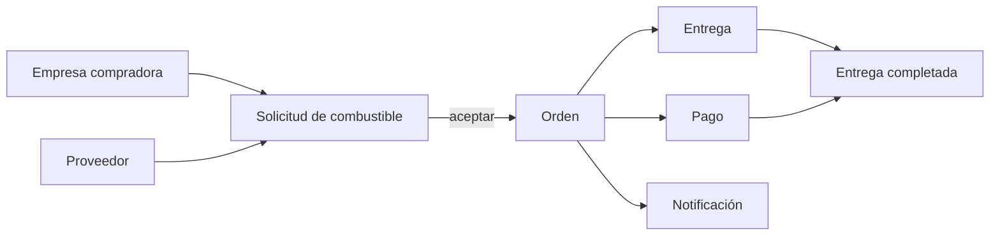
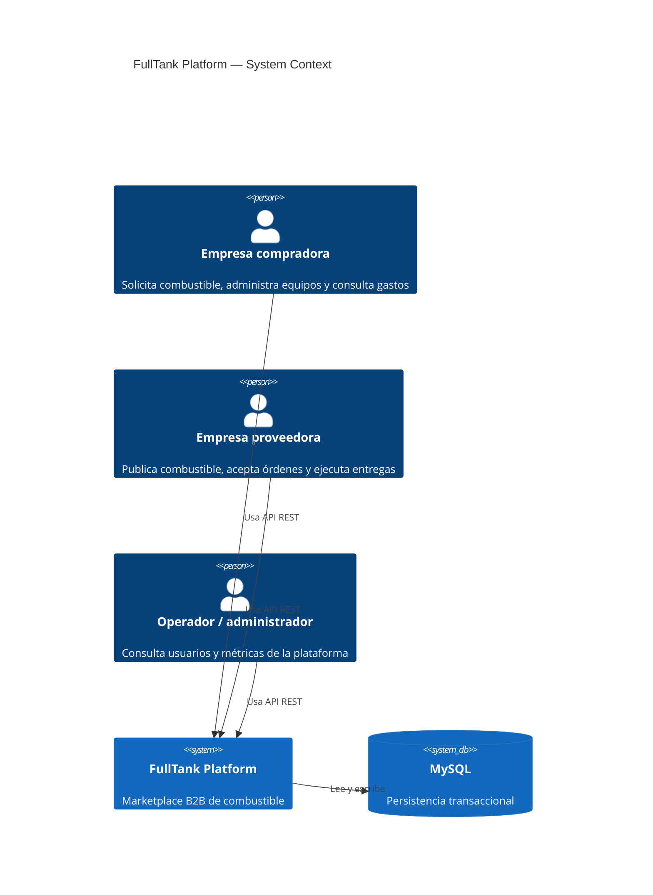
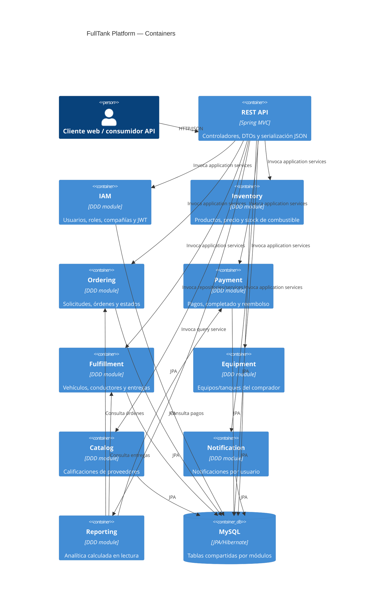
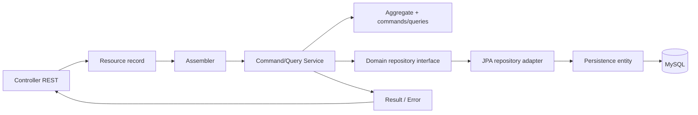

# FullTank Platform — reporte técnico

## 1. Resumen ejecutivo

FullTank es una API REST B2B para comercializar combustible entre empresas compradoras y proveedoras. Está implementada como un **monolito modular** Spring Boot: todos los módulos corren dentro de un único proceso y comparten una base MySQL, pero el código está separado por bounded contexts y capas DDD.

El recorrido de negocio principal es:



Los endpoints están bajo `/api/v1`. La aplicación escucha en el puerto `8080` por defecto y expone OpenAPI en `/api-docs` y Swagger UI en `/swagger-ui.html`.

## 2. Arquitectura C4

### Nivel 1 — contexto



### Nivel 2 — contenedores lógicos



### Nivel 3 — patrón interno de un módulo



La separación no es uniforme: `vehicles`, `drivers` y `provider-ratings` acceden al repositorio directamente desde el controlador; `fuel-requests` también usa un servicio concreto y entidades JPA. Por tanto, el patrón DDD es la intención dominante, no una regla aplicada a todos los módulos.

## 3. Endpoints

Todos los endpoints siguientes requieren `Authorization: Bearer <jwt>`, excepto los marcados como públicos. Los cuerpos son JSON y sus campos corresponden a los records indicados.

### IAM y autenticación

| Método y ruta | Acceso | Función / cuerpo principal |
|---|---|---|
| `POST /api/v1/authentication/sign-up` | Público | Registra usuario y una empresa nueva atómicamente. Recibe `username`, `password`, un solo `roles` y exactamente uno de `buyerCompany` o `providerCompany`; los IDs los asigna el backend. |
| `POST /api/v1/authentication/password-reset/request` | Público | Envía un enlace de un solo uso al correo asociado, si existe. Siempre devuelve el mismo mensaje para no revelar cuentas. |
| `POST /api/v1/authentication/password-reset/confirm` | Público | Cambia la contraseña con token de un solo uso (30 min) y `newPassword` de al menos 8 caracteres. |
| `POST /api/v1/authentication/sign-in` | Público | Autentica: `username`, `password`; genera JWT de 7 días. |
| `GET /api/v1/users` | Protegido | Lista usuarios. |
| `GET /api/v1/users/{userId}` | Protegido | Obtiene usuario o `404`. |
| `POST /api/v1/buyer-companies` | Público | Crea empresa compradora: `name`, `ruc`, `sector`, `address`, `contactEmail`, `phone`. |
| `GET /api/v1/buyer-companies` | Protegido | Lista compradores. |
| `GET /api/v1/buyer-companies/{companyId}` | Protegido | Obtiene comprador o `404`. |
| `PUT /api/v1/buyer-companies/{companyId}` | Protegido | Actualiza comprador. |
| `POST /api/v1/provider-companies` | Público | Crea proveedor: `name`, `ruc`, `rating`, `address`, `phone`, `fuelTypesOffered`, `description`. |
| `GET /api/v1/provider-companies` | Protegido | Lista proveedores. |
| `GET /api/v1/provider-companies/{providerId}` | Protegido | Obtiene proveedor o `404`. |
| `PUT /api/v1/provider-companies/{providerId}` | Protegido | Actualiza proveedor. |

### Inventario y equipos

| Método y ruta | Función |
|---|---|
| `POST /api/v1/fuel-products` | Crea producto (`name`, `fuelType`, `pricePerUnit`, `unit`, `availableStock`, `capacity`, `providerId`, `active`). |
| `GET /api/v1/fuel-products` | Lista productos. |
| `GET /api/v1/fuel-products/{fuelProductId}` | Consulta producto. |
| `GET /api/v1/fuel-products/provider/{providerId}` | Filtra por proveedor. |
| `PUT /api/v1/fuel-products/{fuelProductId}` | Actualiza datos del producto. |
| `POST /api/v1/fuel-products/{fuelProductId}/update-stock` | Reemplaza stock con `{newStock}`. |
| `DELETE /api/v1/fuel-products/{fuelProductId}` | Elimina/desactiva según el servicio; responde `204` en éxito. |
| `POST /api/v1/equipment` | Crea equipo/tanque del comprador. Incluye `equipmentType`, `fuelType`, capacidad, nivel, ubicación, autorefill y `companyId`. |
| `POST /api/v1/equipment/{equipmentId}/update` | Actualiza equipo. |
| `POST /api/v1/equipment/{equipmentId}/favorite-provider` | Asigna proveedor favorito con `{providerId}`. |
| `GET /api/v1/equipment` | Lista equipos. |
| `GET /api/v1/equipment/{equipmentId}` | Consulta equipo. |
| `GET /api/v1/equipment/company/{companyId}` | Lista equipos de una compañía. |

Tipos relevantes: `FuelType` incluye `DIESEL`, `GASOLINE`, variantes de octanaje, `GLP` y `GNV`; `EquipmentType` se define en su value object.

### Ordering: solicitudes y órdenes

| Método y ruta | Función / reglas observables |
|---|---|
| `POST /api/v1/fuel-requests` | Crea solicitud con comprador, proveedor, equipo/producto, cantidad, precio, dirección, fecha y origen. |
| `GET /api/v1/fuel-requests` | Lista; filtros opcionales `buyerCompanyId` y `providerId`. |
| `POST /api/v1/fuel-requests/{requestId}/accept` | Acepta solicitud y crea/devuelve una orden. |
| `POST /api/v1/fuel-requests/{requestId}/reject` | Rechaza con `{reason}`. |
| `POST /api/v1/fuel-orders` | Crea orden directamente con `companyId`, `providerId`, `fuelProductId`, `equipmentId`, cantidad, dirección y fecha. |
| `POST /api/v1/fuel-orders/{orderId}/confirm` | Confirma orden. |
| `POST /api/v1/fuel-orders/{orderId}/cancel` | Cancela orden. |
| `GET /api/v1/fuel-orders` | Lista órdenes. |
| `GET /api/v1/fuel-orders/{orderId}` | Consulta orden. |
| `GET /api/v1/fuel-orders/company/{companyId}` | Ordenes de comprador. |
| `GET /api/v1/fuel-orders/provider/{providerId}` | Ordenes de proveedor. |

Estados de solicitud: `PENDING → APPROVED` o `REJECTED`. Estados de orden definidos: `PENDING`, `CONFIRMED`, `DISPATCHED`, `PENDING_PAYMENT`, `PAID`, `IN_PROGRESS`, `DELIVERED`, `CANCELLED`. Los cambios de estado válidos se aplican en los agregados/servicios, no en el controlador.

### Payment

| Método y ruta | Función |
|---|---|
| `POST /api/v1/payments` | Crea pago para `orderId`, `companyId`, `amount` y `paymentMethod`. |
| `POST /api/v1/payments/{paymentId}/complete` | Completa pago con `{transactionReference}`. |
| `POST /api/v1/payments/{paymentId}/refund` | Reembolsa pago. |
| `GET /api/v1/payments` | Lista pagos. |
| `GET /api/v1/payments/{paymentId}` | Consulta pago. |
| `GET /api/v1/payments/order/{orderId}` | Pago asociado a orden. |
| `GET /api/v1/payments/company/{companyId}` | Pagos de compañía. |

Estados: `PENDING`, `COMPLETED`, `FAILED`, `REFUNDED`. Métodos: `BANK_TRANSFER`, `CREDIT_CARD`, `DEBIT_CARD`, `CASH`.

### Fulfillment

| Método y ruta | Función |
|---|---|
| `POST /api/v1/deliveries` | Crea entrega para orden, proveedor, conductor y vehículo; recibe fecha programada y notas. |
| `POST /api/v1/deliveries/{deliveryId}/dispatch` | Marca despacho. |
| `POST /api/v1/deliveries/{deliveryId}/complete` | Marca entrega completada. |
| `POST /api/v1/deliveries/{deliveryId}/fail` | Marca fallo con `{reason}`. |
| `GET /api/v1/deliveries` | Lista entregas. |
| `GET /api/v1/deliveries/{deliveryId}` | Consulta entrega. |
| `GET /api/v1/deliveries/order/{orderId}` | Busca entrega por orden. |
| `GET /api/v1/deliveries/provider/{providerId}` | Filtra por proveedor, aunque internamente carga todas y filtra en memoria. |
| `GET /api/v1/vehicles?providerId={id}` | Vehículos de proveedor. También CRUD con `GET /{id}`, `POST`, `PUT /{id}`, `DELETE /{id}`. |
| `GET /api/v1/drivers?providerId={id}` | Conductores de proveedor. También CRUD con `GET /{id}`, `POST`, `PUT /{id}`, `DELETE /{id}`. |

`DeliveryStatus` y las reglas exactas de transición están en el agregado/servicio de fulfillment. Vehículos y conductores aplican por defecto `unit=LITERS` (vehículo) y `status=AVAILABLE` cuando faltan esos valores.

### Catálogo, notificaciones y analítica

| Método y ruta | Función |
|---|---|
| `GET /api/v1/provider-ratings?companyId=&providerId=` | Lista calificaciones con filtros opcionales. |
| `POST /api/v1/provider-ratings` | Crea rating 1–5; valida que existan comprador/proveedor y evita duplicado por pareja. |
| `PUT /api/v1/provider-ratings/{id}` | Cambia solo el rating; compañía y proveedor no pueden cambiar. |
| `POST /api/v1/notifications` | Crea notificación. Puede identificar destinatario por `userId`, `companyId` o `providerId`. |
| `POST /api/v1/notifications/{notificationId}/mark-as-read` | Marca como leída. |
| `GET /api/v1/notifications/{notificationId}` | Consulta notificación. |
| `GET /api/v1/notifications/user/{userId}` | Lista notificaciones de usuario. |
| `GET /api/v1/notifications/user/{userId}/unread` | Lista no leídas. |
| `GET /api/v1/notifications/buyer/{companyId}` | Resuelve el usuario de la compañía y lista sus notificaciones. |
| `GET /api/v1/notifications/provider/{providerId}` | Igual, para proveedor. |
| `GET /api/v1/analytics/platform` | Totales globales de órdenes, entregas, pagos, ingresos y pendientes. |
| `GET /api/v1/analytics/providers/{providerId}` | Órdenes, confirmadas, canceladas, ingresos y revenue mensual. |
| `GET /api/v1/analytics/buyers/{companyId}` | Órdenes, gasto, pagos y gasto mensual del comprador. |

## 4. Cómo funciona internamente

1. Spring Boot descubre los controladores y servicios mediante component scanning. `FullTankPlatformApplication` habilita JPA auditing.
2. La petición entra por Spring MVC. El filtro bearer busca el header `Authorization`, valida el JWT y carga el usuario por username. La sesión es stateless y CSRF está deshabilitado.
3. El controlador convierte el JSON `Resource` en un command/query mediante un assembler.
4. Los command services crean o modifican agregados de dominio. Los query services consultan repositorios por interfaces del dominio.
5. Los adapters traducen entre agregados y `PersistenceEntity`; Spring Data JPA/Hibernate ejecuta SQL contra MySQL.
6. Las respuestas de comandos usan `Result<T, ApplicationError>` y `ResponseEntityAssembler`; las consultas devuelven `200` o `404` con `Optional`.
7. `GlobalExceptionHandler` convierte errores de validación, argumentos y excepciones no controladas a `ErrorResource`.
8. Reporting compone consultas de Ordering, Payment y Fulfillment en memoria; no tiene tablas propias.

### Flujo solicitud → orden

`FuelRequestService.create` persiste la solicitud. `accept` obtiene la solicitud, consulta el producto y crea la orden; `reject` registra el motivo. La API también permite crear una orden directamente, por lo que la solicitud no es un requisito técnico.

### Flujo orden → pago → entrega

Payment recibe `orderId` y consulta el repositorio de órdenes para validar/actualizar el contexto; el agregado Payment controla `complete`, `refund` y `fail`. Fulfillment crea una Delivery vinculada por IDs y cambia su estado con comandos de dispatch, complete o fail. No se observa un bus de eventos ni una transacción distribuida entre módulos.

### Analítica

- Proveedor: toma sus órdenes, identifica pagos completados cuyos `orderId` pertenecen a esas órdenes y suma montos.
- Comprador: toma sus órdenes y pagos, suma solo pagos completados y agrupa por `YearMonth`.
- Plataforma: carga todas las órdenes, entregas y pagos y calcula totales en memoria.

## 5. Dependencias y configuración

| Dependencia / tecnología | Uso |
|---|---|
| Java `26` | Lenguaje objetivo configurado en Maven. |
| Spring Boot `4.0.6` | Runtime y autoconfiguración. |
| Spring Web | REST/MVC y JSON. |
| Spring Data JPA + Hibernate | Persistencia y repositorios. |
| MySQL Connector/J | Driver de producción/desarrollo. |
| Spring Security | Autenticación, autorización, filtro bearer y sesiones stateless. |
| JJWT `0.12.6` | Firma y validación de JWT. |
| Spring Validation | Validación de cuerpos cuando se declaran constraints. |
| Springdoc OpenAPI `3.0.3` | OpenAPI y Swagger UI. |
| Lombok | Getters/setters/constructores y logging. |
| Apache Commons Lang3 | Utilidades auxiliares. |
| `pluralize` `1.0.0` | Estrategia de nombres físicos de tablas pluralizadas. |
| H2 | Tests. |
| Spring DevTools | Runtime de desarrollo, opcional. |

Configuración principal: perfil por defecto `dev`, MySQL configurable con `DATABASE_*` o `MYSQL_*`, puerto con `PORT`, orígenes CORS con `CORS_ALLOWED_ORIGINS`, y secreto JWT con `AUTHORIZATION_JWT_SECRET`. Hibernate usa `ddl-auto=update`; esto facilita desarrollo, pero no sustituye migraciones versionadas para producción.

## 6. Observaciones y riesgos técnicos

- La autorización es globalmente autenticada, pero no se observan restricciones por rol con `@PreAuthorize`; cualquier usuario autenticado puede alcanzar todos los endpoints protegidos.
- El secreto JWT tiene un valor por defecto inseguro (`WriteHereYourSecretStringForTokenSigningCredentials`); debe ser obligatorio y externo en producción.
- Hay validación inconsistente: varios `Resource` no tienen anotaciones `@Valid`/Bean Validation y algunos controladores aceptan entidades/records directamente.
- `GET /deliveries/provider/{providerId}` hace `findAll()` y filtra en memoria; debe pasar a una consulta del repositorio si el volumen crece.
- Reporting hace varios `findAll()` completos y agrupa en memoria; es suficiente para un MVP, pero tiene coste O(n) por cada lectura y presión de memoria.
- `vehicles`, `drivers`, `provider-ratings` y parte de `fuel-requests` saltan la capa de aplicación; esto aumenta el acoplamiento del HTTP con persistencia.
- La API usa `Double` para precios, cantidades e ingresos. Para dinero conviene `BigDecimal`.
- `application-dev.properties` deja `spring.jpa.open-in-view=true`, mientras MySQL lo desactiva; el comportamiento cambia por perfil.
- `ddl-auto=update` puede alterar el esquema automáticamente y no hay evidencia de migraciones Flyway/Liquibase.
- Las clases vacías que existían como marcadores (`InventoryController`, `OrderingController`, `FulfillmentController`, `NotificationController`, `DirectoryController`, `PaymentController`) fueron **eliminadas en T24-A** por no tener referencias ni endpoints; se conservan los diagramas PlantUML por contexto, ya sin esos nodos.

## 7. Pruebas y estado del proyecto

Solo se observa una prueba de contexto en `src/test/java/com/primefuel/fulltank/platform/FullTankPlatformApplicationTests.java`; no hay una suite visible de contratos REST, autorización por rol, transiciones de estado o integración con MySQL. El reporte describe el comportamiento estático del código; para verificar contratos efectivos conviene arrancar la aplicación y consultar `/v3/api-docs`.

## 8. Estructura de paquetes

```text
com.primefuel.fulltank.platform
├── iam           usuarios, compañías, roles, JWT y BCrypt
├── inventory     productos y stock
├── ordering      solicitudes y órdenes
├── payment       pagos
├── fulfillment   entregas, vehículos y conductores
├── equipment     equipos/tanques y proveedor favorito
├── catalog       ratings de proveedores
├── notification  notificaciones
├── reporting     consultas analíticas
└── shared        errores, CORS, OpenAPI, JPA y resultados
```

## 9. Contratos JSON de entrada y paridad mobile

Inventario de cuerpos obtenido de `@RequestBody` y sus Resource records. Los nombres JSON son los nombres de componentes Java en `camelCase`; enums se envían como strings con el nombre exacto en mayúsculas. Las fechas `LocalDate` usan `yyyy-MM-dd`.

| Endpoint | Cuerpo JSON esperado |
|---|---|
| `POST /authentication/sign-in` | `{"username":"...","password":"..."}` |
| `POST /authentication/sign-up` | `{"username":"...","password":"...","roles":["ROLE_BUYER"],"buyerCompany":{"name":"...","ruc":"...","sector":"...","address":"...","contactEmail":"...","phone":"..."}}` |
| `POST /authentication/password-reset/request` | `{"email":"..."}` |
| `POST /authentication/password-reset/confirm` | `{"token":"...","newPassword":"..."}` |
| `POST`, `PUT /buyer-companies[/{id}]` | `{"name":"...","ruc":"...","sector":"...","address":"...","contactEmail":"...","phone":"..."}` |
| `POST`, `PUT /provider-companies[/{id}]` | `{"name":"...","ruc":"...","rating":4.5,"address":"...","phone":"...","fuelTypesOffered":["DIESEL"],"description":"..."}` |
| `POST /fuel-products` | `{"name":"...","fuelType":"DIESEL","pricePerUnit":1.25,"unit":"LITERS","availableStock":500,"capacity":1000,"providerId":1,"active":true}` |
| `PUT /fuel-products/{id}` | Mismos campos de producto excepto `providerId`. |
| `POST /fuel-products/{id}/update-stock` | `{"newStock":500}` |
| `POST /equipment` | `{"name":"...","equipmentType":"TRUCK","licensePlate":"...","fuelType":"DIESEL","tankCapacity":1000,"currentLevel":400,"location":"...","status":"ACTIVE","autoRefill":false,"refillThreshold":20,"lastRefillDate":"2026-09-11","companyId":1,"favoriteProviderId":2}` |
| `POST /equipment/{id}/update` | Mismos campos editables que equipment, sin `companyId`. |
| `POST /equipment/{id}/favorite-provider` | `{"providerId":2}` |
| `POST /fuel-orders` | `{"companyId":1,"providerId":2,"fuelProductId":3,"equipmentId":4,"requestedQuantity":100,"deliveryAddress":"...","scheduledDate":"2026-09-11"}` |
| `POST /fuel-requests` | `{"buyerCompanyId":1,"providerId":2,"equipmentId":4,"fuelProductId":3,"quantity":100,"unit":"LITERS","deliveryAddress":"...","deliveryDate":"2026-09-11","source":"MANUAL"}`. `unit` y `source` son opcionales; producto, combustible, nombre y precio se derivan del producto registrado. |
| `POST /fuel-requests/{id}/reject` | `{"reason":"..."}` |
| `POST /payments` | `{"orderId":1,"companyId":1,"amount":125,"paymentMethod":"BANK_TRANSFER"}` |
| `POST /payments/{id}/complete` | `{"transactionReference":"..."}` |
| `POST /deliveries` | `{"orderId":1,"providerId":2,"driverId":3,"vehicleId":4,"scheduledDate":"2026-09-11","notes":"..."}` |
| `POST /deliveries/{id}/fail` | `{"reason":"..."}` |
| `POST /vehicles`, `PUT /vehicles/{id}` | `{"providerId":2,"licensePlate":"...","brand":"...","model":"...","capacity":1000,"unit":"LITERS","status":"AVAILABLE"}`. `id` solo se devuelve; no se necesita en el body. |
| `POST /drivers`, `PUT /drivers/{id}` | `{"providerId":2,"firstName":"...","lastName":"...","licenseNumber":"...","phoneNumber":"...","email":"...","status":"AVAILABLE"}`. `id` solo se devuelve. |
| `POST /provider-ratings`, `PUT /provider-ratings/{id}` | `{"companyId":1,"providerId":2,"rating":5}`. Para actualizar, los IDs deben permanecer iguales a los de la calificación existente. |
| `POST /notifications` | `{"userId":1,"companyId":null,"providerId":null,"type":"NEW_REQUEST","title":"...","message":"...","referenceId":1}`. Se resuelve el destinatario mediante `userId`, `companyId` o `providerId`. |

No reciben body: aceptar solicitud, confirmar/cancelar orden, completar/reembolsar pago, dispatch/completar entrega, asignar proveedor favorito sí recibe body, marcar notificación leída, y los DELETE. Las acciones de rechazo/fallo sí exigen `reason` de forma lógica.

### Diferencias observadas en Mobile

- El login mobile envía correctamente `username` y `password`. La respuesta se amplió para incluir `roles`, `companyId` y `providerId`, necesarios para no depender de IDs fijos.
- `ApiOrdersRepository.create` manda `fuel`/`quantity`, incompatible con `POST /fuel-orders`; faltan identificadores de compañía, proveedor, producto/equipo, dirección y fecha.
- `ApiInventoryRepository.save` manda `type`/`price`/`availability`; el backend recibe `fuelType`/`pricePerUnit`/`availableStock`/`capacity`/`active`.
- `ApiDispatchRepository.createVehicle` manda `plate`/`type`; el backend recibe `licensePlate`/`brand`/`model`/`capacity`/`unit`/`status`/`providerId`. Su listado también debe enviar el query param obligatorio `providerId`.
- `FullTankApi` usa mapas abiertos para la mayoría de los cuerpos; no hay comprobación estática de que los keys coincidan con estos contratos.
- `fuelRequests()` y `providerRatings()` interpolan parámetros opcionales como texto `null`; deben omitir los filtros ausentes.
- La UI modela estados como `approved`, `in_transit` y `rejected`; el backend usa `CONFIRMED`, `DISPATCHED`, `DELIVERED`, `CANCELLED` para órdenes y `PENDING`, `APPROVED`, `REJECTED` para solicitudes. El mobile debe mapear ambos recursos por separado.
- Los adaptadores de producto, orden, vehículo y reporte buscan propiedades que no existen en los responses del backend (`price`, `quantity`, `total`, `plate`, `revenue`); leer campos coincidentes es parte del mismo contrato, aunque no sean JSON de entrada.

### Validación del contrato

Los request records no declaran `@NotNull`/`@NotBlank` y los controladores no usan `@Valid`; por tanto, los campos descritos no están todos formalmente marcados como obligatorios en OpenAPI. Hay validaciones puntuales en servicios (por ejemplo, rating de 1 a 5, motivo de rechazo, recursos asociados para crear una entrega), pero no existe una política uniforme. Antes de cerrar la integración se deben fijar obligatoriedad y nulabilidad en backend, reflejarlas en DTOs mobile y cubrirlas con pruebas de contrato.


El correo de recuperación requiere `SMTP_HOST`, `SMTP_PORT`, `SMTP_USERNAME`, `SMTP_PASSWORD`, `SMTP_AUTH`, `SMTP_STARTTLS` y `MAIL_FROM`. `PASSWORD_RESET_LINK` debe apuntar a un enlace compatible con la app (por defecto `fulltank:///reset-password`).
