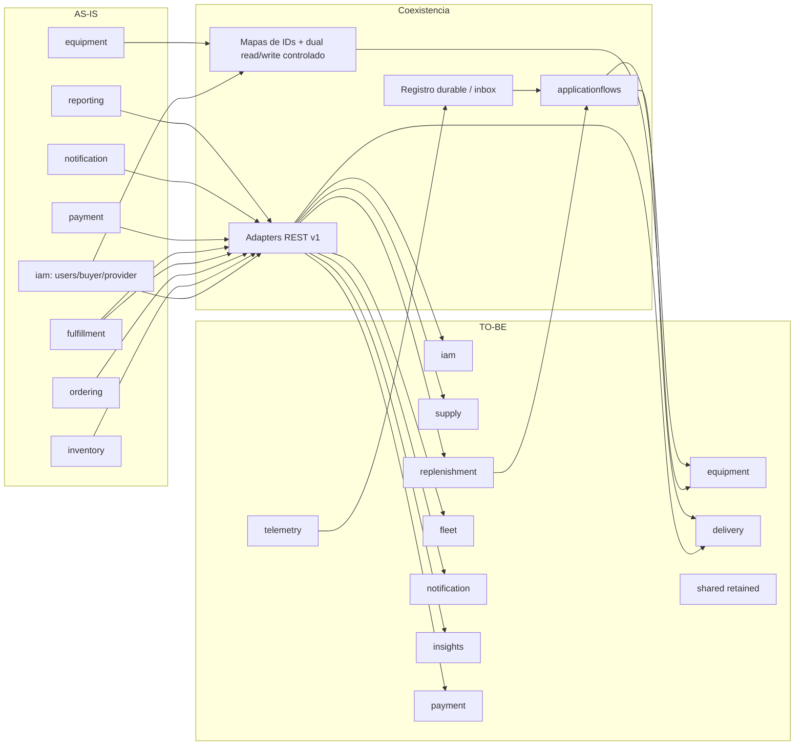
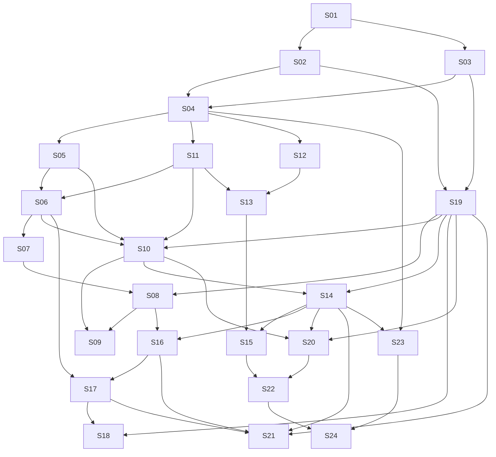
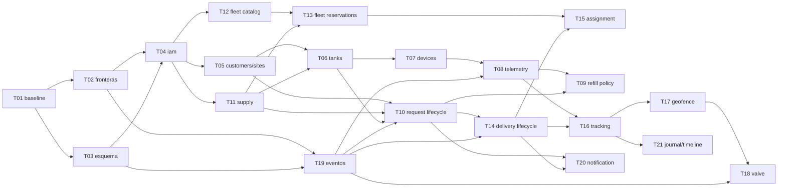

# PrimeFuel — ruta de migración arquitectónica spec-driven

**Estado:** plan de implementación; no autoriza cambios productivos.  
**Baseline verificado:** `main@e1084418e63e45a42b95a6198e8c222c41f0e5b9`, 314 fuentes Java, 77 operaciones REST, 10/10 pruebas H2 verdes con Java 26.0.2.  
**Fuentes, en orden de autoridad:** repositorio actual; modelo aprobado de negocio; informe de descubrimiento del 21-09-2026; pruebas y comportamiento ejecutable.  
**Destino:** monolito modular centrado en el distribuidor logístico de combustible como tenant; los compradores industriales son cuentas/usuarios asociados y sus tanques originan el flujo de reposición.

## 1. Estrategia de migración

La migración usa un *strangler* dentro del monolito. Las rutas v1 permanecen como adapters mientras los módulos destino publican interfaces pequeñas y estables. Cada cambio de datos sigue `expandir → backfill idempotente → comparar → cambiar lecturas → cambiar escrituras → retirar`, y cada cambio de comportamiento empieza con caracterización. No se renombran paquetes ni se extraen despliegues por adelantado.

Las primeras seams son `iam.api`, `equipment.api`, `supply.api`, `replenishment.api`, `fleet.api`, `delivery.api` y contratos `events`; `applicationflows` actúa como composition root sin reglas ni persistencia. Los repositorios y entidades JPA quedan internos al módulo dueño. Esto concentra invariantes, eleva la locality y evita interfaces superficiales de una clase por operación.

Spring Modulith es una opción de verificación, no una precondición asumida. La documentación consultada confirma `ApplicationModules.verify()` y `@ApplicationModuleTests`, pero la matriz recuperada todavía identifica la línea 2.0/Boot 4 como snapshot. Por ello `T02-A` debe fijar una versión estable compatible o elegir una regla arquitectónica equivalente; el resto del DAG no queda atado a una dependencia no validada.

Decisiones operativas:

- Las rutas v2 se introducen aditivamente; ningún `POST` se redirige.
- Los defectos caracterizados se etiquetan como conocidos; no se convierten en invariantes deseables.
- La automatización de reposición inicia en *shadow mode*.
- Geocerca y válvula inician en detección; solo se declara prevención después de prueba física fail-safe.
- `iam`, `equipment` y `shared` conservan sus nombres. La migración profundiza sus interfaces y ownership, pero no crea módulos sustitutos llamados `identity` o `assets`.
- `payment` conserva su nombre y sus datos mientras se define su responsabilidad comercial. Debe desacoplarse del lifecycle físico, pero no se clasifica como legado ni se renombra a `legacybilling`.
- Una relación de tenant desconocida entra en cuarentena; nunca se infiere de `favoriteProviderId` ni de la última orden.

### Decisiones de nombres y ownership de bounded contexts

| Bounded context | Decisión aprobada | Alcance de la migración |
|---|---|---|
| `iam` | Se conserva como `iam`. | Incorpora Organization, Membership, permisos por alcance e identidad técnica detrás de `iam.api`; no se crea `identity`. |
| `equipment` | Se conserva como `equipment`. | Profundiza su modelo para incluir CustomerAccount, CustomerSite, Tank y DeviceBinding; no se crea `assets`. El nombre `Equipment` puede seguir como concepto general, mientras `Tank` identifica el depósito monitorizado. |
| `shared` | Se conserva como `shared`. | Mantiene únicamente soporte técnico transversal. No posee reglas, repositorios ni modelos de negocio. |
| `payment` | Se conserva como `payment` durante la decisión de producto. | Se caracteriza y desacopla de `ordering`/`delivery`; no se renombra ni elimina por anticipado. |

## 2. Diagrama de transición

## 3. DAG de dependencias

La arista `A → B` significa que B no puede fusionarse hasta que A cumpla su gate de salida.

## 4. Oleadas de migración

### W0 — Baseline reproducible

- **Objetivo:** congelar contratos y comportamiento actual sin cambiar reglas.
- **Entry criteria:** checkout limpio en `e108441`; JDK 26; perfiles de prueba aislados.
- **Specs incluidas:** S01.
- **Dependencias:** ninguna.
- **Riesgos:** fixtures contra entorno compartido; convertir defectos en comportamiento aprobado; consumidor mobile desconocido.
- **Estado posterior:** ledger 77/77, matriz de estados y seguridad reproducible, snapshot de esquema y consumidores.
- **Exit criteria:** build; 10 pruebas previas; caracterización v1; casos negativos tenant A/B; MySQL aislado preparado.
- **Rollback point:** retirar solo el harness nuevo; cero cambios de datos o contratos.

### W1 — Guardrails, esquema y entrega durable

- **Objetivo:** hacer verificables las seams y reproducible la base de datos antes de mover ownership.
- **Entry criteria:** W0 aprobada; violaciones actuales inventariadas.
- **Specs incluidas:** S02, S03, S19.
- **Dependencias:** S01; decisión de herramienta en T02-A; snapshot autorizado en T03-A.
- **Riesgos:** BOM incompatible con Boot 4/Java 26; drift real; duplicación o pérdida de eventos.
- **Estado posterior:** baseline arquitectónico decreciente, migraciones expand-only y publicación recuperable.
- **Exit criteria:** violación nueva falla; BD vacía y snapshot convergen; replay no duplica efectos.
- **Rollback point:** volver a binario anterior compatible con esquema expandido; pausar consumers, conservar backlog.

### W2 — Identidad, tenant y clientes

- **Objetivo:** hacer al distribuidor la autoridad tenant y asociar clientes/sitios explícitamente.
- **Entry criteria:** W1; mapa de propiedad revisado; U01/U15 resueltas para filas ambiguas.
- **Specs incluidas:** S04, S05.
- **Dependencias:** S02, S03.
- **Riesgos:** fuga cross-tenant y asignación incorrecta de históricos.
- **Estado posterior:** `Organization`, `Membership`, `CustomerAccount` y `CustomerSite` con IDs legacy trazables.
- **Exit criteria:** fixtures A/B; revocación efectiva; backfill repetible y conciliado; ambiguos en cuarentena.
- **Rollback point:** feature switch a lectura legacy; detener onboarding nuevo; conservar tablas y mapa.

### W3 — Supply, tanques y solicitud manual

- **Objetivo:** establecer producto tenant, Tank y lifecycle de `ReplenishmentRequest` sin automatización.
- **Entry criteria:** W2; unidad/volumen/fecha decididos; reglas U02/U05/U11 registradas.
- **Specs incluidas:** S11, S06, S10.
- **Dependencias:** S03, S04, S05, S19.
- **Riesgos:** reinterpretar stock/capacidad; pérdida de IDs; cambio silencioso de `APPROVED`.
- **Estado posterior:** solicitud manual aceptable una vez, con snapshots de cliente/tanque/producto y orden legacy compatible.
- **Exit criteria:** concurrencia accept/reject; rangos de volumen; reserva supply; contratos v1 dorados.
- **Rollback point:** desactivar rutas v2 y dual-write; leer legacy; conservar mapas/proyecciones.

### W4 — Dispositivos, telemetría y reposición automática

- **Objetivo:** atribuir lecturas, conservarlas y generar una solicitud por episodio controlado.
- **Entry criteria:** W3; U03/U04/U10 resueltas; dispositivos de prueba y credenciales rotables.
- **Specs incluidas:** S07, S08, S09.
- **Dependencias:** S06, S10, S19.
- **Riesgos:** reloj/protocolo/calibración; ruido; replay; escala desconocida.
- **Estado posterior:** ingestión idempotente y política en *shadow mode*; manual sigue disponible.
- **Exit criteria:** desorden no retrocede nivel; duplicados no duplican efectos; cien lecturas bajas crean como máximo una solicitud.
- **Rollback point:** desactivar generación automática y consumidores; conservar lecturas, inbox y solicitudes para conciliación.

> **Decisión de producto (revisión posterior) — S07/S08 quedan built-but-frozen.** El código ya commiteado
> (`telemetry`, `devicebinding`, migraciones `V12`–`V14`) **se conserva tal cual**: no se revierte, no se
> elimina y no se construye nada nuevo sobre esa infraestructura IoT. No hay más desarrollo planeado para
> la telemetría de sensores. S09 (reposición automática) **sí continúa**: su evaluación se dispara tanto por
> telemetría (si algún día existe) como por **carga manual de nivel**, de modo que la generación automática
> no depende de sensores ni de `devicebinding`.

### W5 — Fleet, reservas, delivery y asignación

- **Objetivo:** asignar recursos elegibles solo después de aceptación y separar alta, inicio y cierre físico.
- **Entry criteria:** W3; U05/U06/U07/U11 resueltas para el alcance inicial.
- **Specs incluidas:** S12, S13, S14, S15.
- **Dependencias:** S02, S03, S04, S10, S11, S19.
- **Riesgos:** doble reserva; capacidad nominal confundida con carga; acoplamiento transaccional.
- **Estado posterior:** reservas exclusivas y delivery con máquina de estados independiente de pago.
- **Exit criteria:** una ganadora en carreras; rollback de reserva; transición inválida devuelve conflicto; bridge v1 probado.
- **Rollback point:** apagar autoasignación; operar reservas existentes; no borrar reservas activas.

### W6 — Tracking, safety y válvula

- **Objetivo:** crear evidencia de transporte, decisión geográfica explicable y comando físico conciliable.
- **Entry criteria:** W4/W5; U08/U09/U10/U18/U20 resueltas; firmware y política offline validados. **Requiere una spec de rediseño antes de iniciar** (ver nota).
- **Specs incluidas:** S16, S17, S18, S21.
- **Dependencias:** S06, S14, S19; ~~S07, S08~~ sustituidas por el rediseño de S16 (S07/S08 están built-but-frozen).
- **Riesgos:** apertura no autorizada, GPS falso, ACK perdido, retención y privacidad.
- **Estado posterior:** tracking y journal append-only; geocerca versionada; outbox/ACK. Detección hasta evidencia física.
- **Exit criteria:** replay/offline/expiración; puntos dentro/fuera/borde; banco físico o alcance explícitamente limitado.
- **Rollback point:** negar nuevas autorizaciones, conciliar comandos pendientes; rollback nunca reabre válvula.

> **Requiere rediseño antes de iniciar — no depender de `telemetry`/`devicebinding` actual.** El roadmap
> original encadenaba W6 (S16 tracking de transporte, S17 geocerca, S18 válvula, S21 journal) a la misma
> infraestructura de telemetría/binding/autenticación de máquina de S07/S08. Con S07/S08 congeladas por
> decisión de producto, **W6 no puede asumir sus dependencias tal como están hoy**: la spec de S16 debe
> rediseñarse (cómo se atribuye la evidencia de transporte a una entrega y cómo se transporta/mide) antes
> de iniciar cualquier ticket de W6. No arrancar W6 con las dependencias actuales.

### W7 — Notificaciones, contratos, Payment y retiro

- **Objetivo:** cerrar compatibilidad, aislar cobros y retirar solo legado con evidencia de no uso.
- **Entry criteria:** W2–W6 estables; ledger de consumidores; decisiones U12/U13/U14/U17.
- **Specs incluidas:** S20, S22, S23, S24.
- **Dependencias:** S03, S04, S10, S14, S15, S19.
- **Riesgos:** ruptura mobile, pérdida financiera, eliminación prematura.
- **Estado posterior:** notificaciones event-driven, adapters v1 medidos, `payment` desacoplado del estado físico y register de retiro cerrado por elemento.
- **Exit criteria:** contratos soportados verdes; restore ensayado; cada ruta/dato tiene dueño; docs reflejan runtime.
- **Rollback point:** reactivar adapter mientras el esquema sea compatible; para contract irreversible usar restore/forward-fix supervisado.

## 5. Catálogo de specs

### Reglas comunes del catálogo

- **Invariantes transversales:** tenant verificado desde el principal; módulos ajenos solo por `api/events`; nunca exponer JPA ni agregados mutables; IDs/correlation preservados; idempotencia donde exista retry; ningún comportamiento físico se habilita por defecto.
- **Definition of Done común:** build y arranque aislado; gates aplicables verdes; contrato y rollback documentados; observabilidad mínima; ningún `UNKNOWN` oculto detrás de una feature activa.
- **Rollback común:** binario anterior compatible con expansión de esquema, feature switch y conservación de datos nuevos; los `DROP` quedan para un release posterior autorizado.

### S01 — Caracterizar contratos y estados actuales

- **SPEC-ID / Título:** S01 / Caracterizar contratos y estados actuales.
- **Objetivo:** crear el oráculo de regresión del AS-IS.
- **Business reason:** migrar sin romper clientes ni ocultar fallos actuales.
- **Architectural reason:** toda seam posterior necesita una prueba en el nivel más alto disponible.
- **Current state:** 10 tests concentrados en IAM; 77 operaciones; sin cobertura logística o concurrente.
- **Desired state:** ledger REST y matriz de estados/ownership ejecutables.
- **In scope / Out of scope:** contratos, autorización, request/order/payment/delivery / corregir reglas o añadir IoT.
- **Invariants:** caracterizar no significa aprobar; cada defecto queda marcado `known-gap`.
- **Public contract changes:** ninguno.
- **Domain events:** ninguno; solo observar efectos actuales.
- **Persistence impact:** fixtures sintéticos y snapshot de metadatos; sin DDL.
- **Security/tenancy impact:** casos A/B, endpoints públicos y IDs cruzados.
- **Dependencies:** ninguna.
- **Acceptance criteria:** ledger 77/77; orden directa, accept/reject, confirm/dispatch, create/complete delivery y payment reproducibles.
- **Test plan:** MockMvc/H2 + MySQL aislado para constraints/carreras; snapshot OpenAPI.
- **Rollback strategy:** borrar solo pruebas/harness nuevos.
- **Definition of Done:** reglas comunes + consumidor conocido o `UNKNOWN` por operación.

### S02 — Establecer fronteras verificables de módulos

- **SPEC-ID / Título:** S02 / Establecer fronteras verificables de módulos.
- **Objetivo:** impedir nuevas dependencias a implementación interna.
- **Business reason:** permitir evolución logística sin regresiones laterales.
- **Architectural reason:** hoy `fulfillment`, `payment` y controllers cruzan repositorios/infrastructure; falta locality.
- **Current state:** paquetes por dominio, pero fronteras convencionales y seams hipotéticas.
- **Desired state:** dependencias permitidas verificadas, baseline decreciente y primer módulo profundo.
- **In scope / Out of scope:** spike de herramienta, `api/events/internal`, lista de excepciones / mover todo o microservicios.
- **Invariants:** `shared` no importa negocio; módulos importan solo `api/events`; snapshots inmutables.
- **Public contract changes:** ninguno REST.
- **Domain events:** solo contratos base, sin consumidores funcionales todavía.
- **Persistence impact:** ninguno.
- **Security/tenancy impact:** `CurrentAccess` pasa por interfaz pública, no por IAM infrastructure.
- **Dependencies:** S01.
- **Acceptance criteria:** una violación de ejemplo falla; primera seam reemplaza un cruce real; baseline no crece.
- **Test plan:** arquitectura + módulo aislado + build Boot 4/JDK 26. Spring Modulith solo con versión estable compatible verificada.
- **Rollback strategy:** retirar dependencia/regla y conservar inventario de violaciones.
- **Definition of Done:** reglas comunes + excepción con dueño/spec de salida.

### S03 — Versionar la evolución del esquema

- **SPEC-ID / Título:** S03 / Versionar la evolución del esquema.
- **Objetivo:** hacer determinista el esquema.
- **Business reason:** reducir riesgo de pérdida o drift al desplegar.
- **Architectural reason:** Hibernate `update` y `MySqlSchemaCompatibilityInitializer` mutan estructura sin historial.
- **Current state:** 15 entidades, 17 tablas declaradas, dos `ALTER` de arranque, sin migrador.
- **Desired state:** baseline versionado y runtime en `validate`.
- **In scope / Out of scope:** snapshot autorizado, baseline, equivalencia y restore / drops o backfill tenant.
- **Invariants:** initializer no se retira hasta equivalencia; migraciones repetibles donde corresponda y versionadas para DDL.
- **Public contract changes:** ninguno.
- **Domain events:** ninguno.
- **Persistence impact:** adopción de Flyway/Liquibase decidida en ticket; expand-only.
- **Security/tenancy impact:** ningún dato productivo se copia a fixtures.
- **Dependencies:** S01.
- **Acceptance criteria:** BD vacía y snapshot legado convergen; arranque no ejecuta DDL fuera del migrador.
- **Test plan:** MySQL aislado, metadata/constraints, upgrade y restore.
- **Rollback strategy:** binario anterior compatible; migraciones forward-only o undo explícito solo si es seguro.
- **Definition of Done:** reglas comunes + runbook por entorno.

### S04 — Introducir organización y membresías de acceso

- **SPEC-ID / Título:** S04 / Introducir organización y membresías de acceso.
- **Objetivo:** establecer al distribuidor como tenant y autoridad.
- **Business reason:** un comprador es una cuenta asociada, no un marketplace peer.
- **Architectural reason:** reemplazar `companyId/providerId` opcionales y roles globales por un seam de acceso coherente.
- **Current state:** signup crea buyer/provider; JWT identifica username y recarga IDs; dos altas de company son públicas.
- **Desired state:** `Organization`, `Membership`, invitación/revocación y `TenantAccess`.
- **In scope / Out of scope:** onboarding distribuidor, invitación, permisos por alcance, bridge roles / SSO o activos.
- **Invariants:** tenant no viene del body; revocación aplica en la siguiente request; admin plataforma no se infiere.
- **Public contract changes:** v2 onboarding/invitations; v1 login conserva campos y agrega membresías de forma compatible.
- **Domain events:** `OrganizationActivated`, `MembershipGranted`, `MembershipRevoked`.
- **Persistence impact:** organizations/memberships e IDs de mapeo; dual-read.
- **Security/tenancy impact:** crítico; deny-by-default y fixture A/B en command/query.
- **Dependencies:** S02, S03.
- **Acceptance criteria:** IDs cruzados denegados; invitación expirada/duplicada falla; token anterior no supera revocación.
- **Test plan:** matriz actor-permiso-scope, métodos REST y repositorios tenant-aware.
- **Rollback strategy:** feature switch a roles legacy sin borrar memberships; detener nuevos invites.
- **Definition of Done:** reglas comunes + ningún endpoint operativo confía en tenant del payload.

### S05 — Incorporar clientes y sitios en Equipment

- **SPEC-ID / Título:** S05 / Incorporar clientes y sitios en Equipment.
- **Objetivo:** modelar cliente y sitio bajo el distribuidor.
- **Business reason:** ubicar tanques y servicio sin selección global de proveedor.
- **Architectural reason:** mantener autenticación y membresías en `iam`, y mover la ficha operativa de `BuyerCompany` al bounded context `equipment` sin renombrar el módulo.
- **Current state:** buyer sin organization; RUC global; pertenencia no declarada.
- **Desired state:** `CustomerAccount` + `CustomerSite` tenant-scoped con mapa de IDs.
- **In scope / Out of scope:** alta/consulta v2, backfill y cuarentena / compartir cliente entre tenants sin decisión.
- **Invariants:** un registro operativo pertenece a un tenant; traslado futuro no reescribe históricos.
- **Public contract changes:** `/api/v2/customers` y `/sites`; v1 buyer-companies usa adapter.
- **Domain events:** `CustomerRegistered`, `CustomerSiteRegistered`.
- **Persistence impact:** tablas/columnas aditivas, mapa `companyId→customerId`, conteos y cuarentena.
- **Security/tenancy impact:** cliente solo consulta su scope; distribuidor solo su organización.
- **Dependencies:** S04.
- **Acceptance criteria:** backfill repetible; cero asignaciones automáticas ambiguas; RUC sigue regla aprobada.
- **Test plan:** A/B, duplicados, backfill parcial/retry y consultas v1/v2.
- **Rollback strategy:** leer buyer_companies y mantener mapas; no revertir filas resueltas.
- **Definition of Done:** reglas comunes + 100% de filas clasificadas o en cuarentena.

### S06 — Establecer Tank y su configuración

- **SPEC-ID / Título:** S06 / Establecer Tank y su configuración.
- **Objetivo:** separar el depósito monitorizado del Equipment genérico.
- **Business reason:** capacidad, producto, sitio y nivel son la base de reposición.
- **Architectural reason:** profundizar `equipment`; eliminar setters REST como seam de telemetría.
- **Current state:** `Equipment` mezcla vehículo/máquina, nivel manual, threshold y favorito.
- **Desired state:** `Tank` con configuración versionada y snapshot de nivel validado.
- **In scope / Out of scope:** capacidad/unidad/producto/sitio, mapa reversible / MQTT o conversión ciega de todo Equipment.
- **Invariants:** capacidad positiva; `0≤nivel≤capacidad`; producto/unidad/sitio/tenant coherentes.
- **Public contract changes:** `/api/v2/tanks`; v1 `/equipment` traduce solo activos mapeables.
- **Domain events:** `TankRegistered`, `TankConfigurationChanged`, `TankLevelUpdated`.
- **Persistence impact:** tanks/config versions o expansión equivalente; mapa equipment/tank.
- **Security/tenancy impact:** el sitio debe pertenecer al mismo cliente y organización.
- **Dependencies:** S05, S11.
- **Acceptance criteria:** valores fuera de rango/unidad incompatible fallan; legacy no mapeable permanece intacto.
- **Test plan:** límites, versiones, lectura tardía y golden DTO v1.
- **Rollback strategy:** lectura legacy y desactivar escrituras v2; conservar mapa.
- **Definition of Done:** reglas comunes + cada tanque tiene origen trazable.

### S07 — Vincular dispositivos con vigencia e identidad

- **SPEC-ID / Título:** S07 / Vincular dispositivos con vigencia e identidad.
- **Objetivo:** atribuir cada lectura al tanque correcto en el tiempo.
- **Business reason:** evitar datos de un dispositivo/tanque ajeno.
- **Architectural reason:** crear una seam técnica revocable antes del adapter de protocolo.
- **Current state:** no hay deviceId, credencial ni historial de instalación.
- **Desired state:** `DeviceBinding` temporal y credencial técnica rotatoria.
- **In scope / Out of scope:** bind/unbind/move y active-binding query / firmware y protocolo definitivo.
- **Invariants:** un binding activo por dispositivo/canal; sin solapamiento; la vigencia manda sobre payload.
- **Public contract changes:** interfaz técnica de provisión; ninguna ruta cliente obligatoria.
- **Domain events:** `DeviceBound`, `DeviceRevoked`, `DeviceMoved`.
- **Persistence impact:** device_bindings, credential references y periodos; sin secretos en eventos.
- **Security/tenancy impact:** autenticación de máquina, rotación, revocación y cuarentena.
- **Dependencies:** S04, S06.
- **Acceptance criteria:** overlap rechazado; lectura tardía atribuida por instante o cuarentena.
- **Test plan:** reloj frontera, credencial ajena, revoke/retry y traslado.
- **Rollback strategy:** bloquear ingestión nueva; mantener historia de bindings.
- **Definition of Done:** reglas comunes + ningún deviceId sin tenant/binding verificable.
- **Product decision (frozen):** built-but-frozen. El código commiteado se conserva, pero no se planea más
  desarrollo sobre `devicebinding`/telemetría IoT de sensores. W6 no debe apoyarse en esta spec tal como está (ver W6).

### S08 — Introducir ingestión de telemetría de tanque

- **SPEC-ID / Título:** S08 / Introducir ingestión de telemetría de tanque.
- **Objetivo:** normalizar y persistir lecturas fiables.
- **Business reason:** alimentar nivel sin depender de edición manual.
- **Architectural reason:** aislar protocolo en un adapter; política de negocio queda fuera.
- **Current state:** sin broker, SDK, endpoint ni storage IoT.
- **Desired state:** `IngestTelemetry` + inbox/checkpoint + evento validado.
- **In scope / Out of scope:** payload versionado, unidades, dedup, calidad y tiempos / umbral o pedidos automáticos.
- **Invariants:** unique device+sequence/eventId; no NaN/Infinity; capturedAt y receivedAt separados.
- **Public contract changes:** contrato técnico versionado; manual v1 sigue activo.
- **Domain events:** `ValidatedTankReading`, `TelemetryRejected`.
- **Persistence impact:** telemetry_readings, inbox/checkpoints; append-only inicial.
- **Security/tenancy impact:** credencial/binding obligatorio; límites de tamaño y rate operable.
- **Dependencies:** S07, S19.
- **Acceptance criteria:** retry no duplica; desorden no retrocede snapshot; crash se recupera.
- **Test plan:** falsificación, replay, backlog, reconexión, unidad y schema version.
- **Rollback strategy:** detener adapter/consumer; conservar inbox y lecturas.
- **Definition of Done:** reglas comunes + modo observación medible.
- **Product decision (frozen):** built-but-frozen. El código commiteado (`telemetry`, `V14`) se conserva,
  pero no se planea más desarrollo. La reposición automática (S09) no depende de esta spec: también se
  dispara por carga manual de nivel.

### S09 — Añadir política de nivel bajo y episodios

- **SPEC-ID / Título:** S09 / Añadir política de nivel bajo y episodios.
- **Objetivo:** crear una necesidad por episodio, no por lectura.
- **Business reason:** evitar pedidos duplicados por ruido.
- **Architectural reason:** policy profunda separada de `equipment` y del adapter IoT.
- **Current state:** `autoRefill/refillThreshold` solo se almacenan.
- **Desired state:** `RefillPolicy` + `RefillEpisode` que invocan replenishment.
- **In scope / Out of scope:** umbral, histéresis, target volume, rearmado/rechazo / ML y optimización.
- **Invariants:** calidad mínima; no otra request activa; volumen positivo y dentro de capacidad.
- **Public contract changes:** configuración v2 por tanque; sin retirar manual.
- **Domain events:** `LowLevelThresholdReached`, luego `ReplenishmentRequestCreated` por S10.
- **Persistence impact:** refill_policies/episodes y clave idempotente.
- **Security/tenancy impact:** solo roles autorizados configuran; evaluación hereda tenant del Tank.
- **Dependencies:** S06, S08, S10.
- **Acceptance criteria:** 100 lecturas bajas→1 request; recuperación+recruce→nuevo episodio; rechazo no crea loop.
- **Test plan:** umbral exacto, histéresis, desorden, reloj controlado y pending request.
- **Rollback strategy:** apagar emisión, dejar shadow y datos.
- **Definition of Done:** reglas comunes + U03/U04 convertidas en política explícita.

### S10 — Introducir lifecycle de ReplenishmentRequest

- **SPEC-ID / Título:** S10 / Introducir lifecycle de ReplenishmentRequest.
- **Objetivo:** representar la intención revisable y su aceptación consumible.
- **Business reason:** el distribuidor decide y traza cada reposición.
- **Architectural reason:** reemplazar las dos rutas FuelRequest/FuelOrder por un agregado con una interface coherente.
- **Current state:** accept crea FuelOrder; también existe orden directa; ownership incompleto.
- **Desired state:** `PENDING→ACCEPTED|REJECTED|CANCELLED`, versión y `ConsumeAcceptance` once-only.
- **In scope / Out of scope:** manual/automatic, revisión, snapshots y bridge / flota, pago o válvula.
- **Invariants:** tenant y relaciones coherentes; qty>0; accept/reject terminal; consumo único.
- **Public contract changes:** `/api/v2/replenishment-requests`; v1 request/order adapters conservan IDs/estados mapeados.
- **Domain events:** `ReplenishmentRequestCreated`, `RequestAccepted`, `RequestRejected`, `RequestCancelled`.
- **Persistence impact:** expandir fuel_requests o tabla destino; version, idempotency/episode y orderId legacy.
- **Security/tenancy impact:** cliente crea dentro de su scope; solo distribuidor autorizado decide.
- **Dependencies:** S05, S06, S11, S19.
- **Acceptance criteria:** carrera accept/reject tiene una ganadora; orden v1 queda correlacionada; cross-tenant falla.
- **Test plan:** matriz de estados, retries, concurrencia MySQL y golden contracts.
- **Rollback strategy:** route v1 al path legacy; conservar request/version/mapa.
- **Definition of Done:** reglas comunes + orden directa v2 imposible.

### S11 — Delimitar producto y disponibilidad de suministro

- **SPEC-ID / Título:** S11 / Delimitar producto y disponibilidad de suministro.
- **Objetivo:** dar ownership tenant a producto y reserva.
- **Business reason:** prometer solo combustible disponible y compatible.
- **Architectural reason:** `delivery` no debe escribir el repositorio inventory.
- **Current state:** stock/precio `Double`, active no filtrado, semántica de stock desconocida.
- **Desired state:** `supply.api` con Volume/unidad y reserva transaccional.
- **In scope / Out of scope:** producto, compatibilidad, reserva/release/reconcile / ERP o almacenes no confirmados.
- **Invariants:** producto tenant; stock no negativo; inactivo no origina request; snapshot histórico.
- **Public contract changes:** `/api/v2/products`; v1 fuel-products compatible por adapter.
- **Domain events:** `ProductChanged`, `SupplyReserved`, `SupplyReleased`, `SupplyReconciled`.
- **Persistence impact:** fuel_products conservada; supply_reservations; decimal/unidad solo tras auditoría.
- **Security/tenancy impact:** ninguna lectura/escritura cross-organization.
- **Dependencies:** S03, S04.
- **Acceptance criteria:** carrera no sobrevende; delete referenciado desactiva; unidad incompatible falla.
- **Test plan:** MySQL concurrente, límites, inactivo, snapshot y v1.
- **Rollback strategy:** apagar reservas nuevas; reconciliar activas; mantener fuel_products.
- **Definition of Done:** reglas comunes + U05 resuelta o capacidad deshabilitada.

### S12 — Definir elegibilidad de conductores y cisternas

- **SPEC-ID / Título:** S12 / Definir elegibilidad de conductores y cisternas.
- **Objetivo:** convertir CRUD en catálogo Fleet con elegibilidad.
- **Business reason:** no asignar recursos suspendidos, vencidos o ajenos.
- **Architectural reason:** concentrar reglas dispersas detrás de `EligibilityQuery`.
- **Current state:** status String, licencia sin vencimiento, driver sin identidad.
- **Desired state:** Driver/Tanker tenant, estados tipados y vigencia.
- **In scope / Out of scope:** habilitación, vínculo con `iam` y query / routing o ranking.
- **Invariants:** mismo tenant, activo y vigente; desactivar no borra histórico.
- **Public contract changes:** `/api/v2/drivers` y `/tankers`; v1 vehicles/drivers adapters.
- **Domain events:** `ResourceEnabled`, `ResourceDisabled`.
- **Persistence impact:** expandir drivers/vehicles; `driverId≠userId`; constraints tenant revisadas.
- **Security/tenancy impact:** solo fleet manager autorizado; IDs cross-tenant denegados.
- **Dependencies:** S02, S04.
- **Acceptance criteria:** suspendido/vencido no se sugiere; update no transfiere tenant.
- **Test plan:** vigencia, permisos, desactivación referenciada y v1.
- **Rollback strategy:** consulta legacy; conservar campos nuevos.
- **Definition of Done:** reglas comunes + U07 documentada.

### S13 — Reservar capacidad y recursos de flota

- **SPEC-ID / Título:** S13 / Reservar capacidad y recursos de flota.
- **Objetivo:** reservar driver+tanker+ventana de forma atómica.
- **Business reason:** evitar doble asignación y capacidad ficticia.
- **Architectural reason:** separar sugerencia revocable de confirmación transaccional.
- **Current state:** capacidad nominal, status y check-then-save sin versión/reserva.
- **Desired state:** `FleetReservation` exclusiva y revalidada dentro de TX.
- **In scope / Out of scope:** volumen, compatibilidad, ventana, release/expiry / multiparada/compartimentos sin confirmar.
- **Invariants:** capacidad utilizable≥volumen; sin overlap; release idempotente; mismo tenant.
- **Public contract changes:** `fleet.api ReserveFleet/ReleaseFleet`; REST v2 solo si operación humana lo requiere.
- **Domain events:** `FleetReserved`, `FleetReleased`.
- **Persistence impact:** fleet_reservations, optimistic version/constraint y claves de idempotencia.
- **Security/tenancy impact:** reservation no acepta organizationId confiado del cliente.
- **Dependencies:** S03, S11, S12.
- **Acceptance criteria:** dos carreras producen una reserva; igualdad de capacidad pasa; rollback libera.
- **Test plan:** barrera concurrente MySQL, ventanas/unidades y fallo parcial.
- **Rollback strategy:** bloquear reservas nuevas; operar/liberar existentes con versión compatible.
- **Definition of Done:** reglas comunes + U05/U06 reflejadas.

### S14 — Separar lifecycle físico de Delivery

- **SPEC-ID / Título:** S14 / Separar lifecycle físico de Delivery.
- **Objetivo:** distinguir asignación, salida, llegada, descarga y cierre.
- **Business reason:** conocer qué ocurrió físicamente sin depender de pago.
- **Architectural reason:** una máquina de estados profunda reemplaza mutaciones cruzadas en callers.
- **Current state:** create ya hace dispatch; complete muta Equipment/Order; guardas débiles.
- **Desired state:** `ASSIGNED→STARTED→ARRIVED→DELIVERING→COMPLETED` y fallos/cancelación explícitos.
- **In scope / Out of scope:** comandos físicos y volumen real / selección fleet o geocerca.
- **Invariants:** transición válida; retry no duplica; complete exige evidencia/volumen; pago no cambia estado físico.
- **Public contract changes:** `/api/v2/deliveries/{id}/start|arrive|complete|fail`; mapper v1.
- **Domain events:** `DeliveryAssigned`, `DeliveryStarted`, `DeliveryArrived`, `DeliveryCompleted`, `DeliveryFailed`.
- **Persistence impact:** version, timestamps/journal y mapeo de estados; no inventar históricos.
- **Security/tenancy impact:** actor/driver/tenant autorizados por transición.
- **Dependencies:** S10, S19.
- **Acceptance criteria:** transición inválida→409; complete repetido no suma; `PAID` no afecta físico.
- **Test plan:** tabla de estados, optimistic concurrency, retries y legacy mapping.
- **Rollback strategy:** mapper v1 + feature switch; no revertir evidencia física.
- **Definition of Done:** reglas comunes + U11 definida.

### S15 — Orquestar asignación después de aceptación

- **SPEC-ID / Título:** S15 / Orquestar asignación después de aceptación.
- **Objetivo:** unir aceptación, reservas y creación de delivery por interfaces públicas.
- **Business reason:** ninguna entrega nace sin necesidad aceptada y recursos reales.
- **Architectural reason:** retirar seis repositorios ajenos de `DeliveryCommandServiceImpl` y ganar locality.
- **Current state:** create descuenta stock, asigna y despacha directamente.
- **Desired state:** `AssignDelivery` en TX local/composition root con `ConsumeAcceptance`, `ReserveSupply`, `ReserveFleet`.
- **In scope / Out of scope:** sugerir/confirmar, compensar, idempotencia / optimización global.
- **Invariants:** aceptación vigente y once-only; reservas exclusivas; fallo revierte todo; asignar≠iniciar.
- **Public contract changes:** create v2 exige request aceptada; v1 adapter con semántica documentada.
- **Domain events:** `DeliveryAssigned`; consume `RequestAccepted` solo como trigger, revalida síncronamente.
- **Persistence impact:** correlation/commandId; sin nuevas escrituras cross-module.
- **Security/tenancy impact:** todas las snapshots comparten organizationId.
- **Dependencies:** S10, S11, S13, S14.
- **Acceptance criteria:** orden legacy sin aceptación no entra a v2; carrera produce una asignación; fallo no deja reserva huérfana.
- **Test plan:** failure injection por paso, retry commandId y concurrencia.
- **Rollback strategy:** apagar autoasignación y mantener bridge manual.
- **Definition of Done:** reglas comunes + cero imports a repositorios ajenos desde delivery.

### S16 — Asociar tracking y carga con entrega

- **SPEC-ID / Título:** S16 / Asociar tracking y carga con entrega.
- **Objetivo:** conservar evidencia de posición/carga/válvula asociada a una entrega.
- **Business reason:** explicar trayecto y descarga.
- **Architectural reason:** muestras frecuentes permanecen fuera del agregado Delivery; proyección reduce su interface.
- **Current state:** timestamps/notas; sin track, load o sensores.
- **Desired state:** proyección consultable con evidencia cruda referenciada.
- **In scope / Out of scope:** binding, calibración, quality/times / time-series externo sin medición.
- **Invariants:** device/tanker/delivery tenant común; tardío no reemplaza latest fiable.
- **Public contract changes:** consulta v2 tracking; ningún cambio v1 obligatorio.
- **Domain events:** `DeliveryTelemetryReceived`, `ValveStateObserved`.
- **Persistence impact:** track/load projection + evidence IDs; sin fabricar histórico.
- **Security/tenancy impact:** GPS y datos de transporte solo por scope permitido.
- **Dependencies:** S07, S08, S14.
- **Acceptance criteria:** binding ajeno rechazado; desorden no retrocede; muestra visible enlaza evidencia.
- **Test plan:** jitter, reloj sesgado, cambio de delivery, calibración/reconexión.
- **Rollback strategy:** detener proyección; conservar raw telemetry.
- **Definition of Done:** reglas comunes + U10/U18 sobre retención registradas.

### S17 — Introducir política geográfica de seguridad

- **SPEC-ID / Título:** S17 / Introducir política geográfica de seguridad.
- **Objetivo:** producir una decisión explicable de descarga.
- **Business reason:** negar apertura fuera del lugar/ventana autorizados.
- **Architectural reason:** política pura y versionada detrás de una sola interface de decisión.
- **Current state:** sin geocerca ni posición confiable.
- **Desired state:** `GeofencePolicy` aplicada a Delivery con evidence/version.
- **In scope / Out of scope:** área, ventana, freshness/accuracy y borde / ejecutar actuador o inventar tolerancias.
- **Invariants:** entrega activa; posición fiable; incertidumbre deniega; política versionada.
- **Public contract changes:** administración v2 restringida; no prometer prevención.
- **Domain events:** `ValveAuthorized` o `ValveBlocked`; no comando físico aún.
- **Persistence impact:** geofence_policies y safety_decisions append-only.
- **Security/tenancy impact:** cliente ajeno no edita; override, si existe, firmado/auditado.
- **Dependencies:** S06, S14, S16.
- **Acceptance criteria:** outside/stale/inaccurate bloquean; regla de borde explícita.
- **Test plan:** puntos, geometría, lat/lon inválida, tiempo y cambio de versión.
- **Rollback strategy:** modo detección/deny; preservar decisiones.
- **Definition of Done:** reglas comunes + U09 aprobada.

### S18 — Ejecutar autorización de válvula con ACK verificable

- **SPEC-ID / Título:** S18 / Ejecutar autorización de válvula con ACK verificable.
- **Objetivo:** distinguir decisión, envío y efecto físico.
- **Business reason:** evitar/reconocer aperturas no autorizadas.
- **Architectural reason:** gateway adapter + outbox, no red dentro del agregado.
- **Current state:** sin firmware/actuador/protocolo.
- **Desired state:** comando firmado, single-use, expirable y ACK correlacionado.
- **In scope / Out of scope:** nonce, revoke, ACK, incident / certificar hardware inexistente.
- **Invariants:** sin delivery+safety válidos no hay comando; replay/expired falla; apertura espontánea crea incidente.
- **Public contract changes:** protocolo técnico versionado; feature flag por dispositivo.
- **Domain events:** `ValveOperationRequested`, `ValveCommandSent`, `ValveStateObserved`, `SafetyIncidentDetected`.
- **Persistence impact:** device_command_outbox, ack y incident journal.
- **Security/tenancy impact:** firma, rotación, least privilege, fail-safe offline.
- **Dependencies:** S16, S17, S19.
- **Acceptance criteria:** replay no abre; reconexión no ejecuta expired; ACK perdido se concilia; prueba física o alcance detection-only.
- **Test plan:** simulador+banco, duplicación, caída, reloj, GPS falso y apertura espontánea.
- **Rollback strategy:** detener nuevos comandos y revocar pendientes; jamás emitir OPEN por rollback.
- **Definition of Done:** reglas comunes + U08 resuelta con evidencia.

### S19 — Publicar eventos de forma duradera

- **SPEC-ID / Título:** S19 / Publicar eventos de forma duradera.
- **Objetivo:** recuperar efectos post-commit sin duplicarlos.
- **Business reason:** no perder notificaciones, proyecciones o integración IoT.
- **Architectural reason:** desacoplar módulos sin confundir `AbstractAggregateRoot` con entrega operativa.
- **Current state:** no hay eventos/listeners de negocio ni registerDomainEvent.
- **Desired state:** registro transaccional/outbox + inbox por consumidor.
- **In scope / Out of scope:** envelope, replay, métricas y DLQ operable / broker externo o exactly-once.
- **Invariants:** hecho+publicación atómicos; `(consumer,eventId)` unique; versión por agregado.
- **Public contract changes:** ninguno REST; contratos events versionados.
- **Domain events:** envelope común para los eventos del catálogo.
- **Persistence impact:** event_publication/outbox/inbox y retención.
- **Security/tenancy impact:** organizationId obligatorio; minimizar PII/secretos.
- **Dependencies:** S02, S03.
- **Acceptance criteria:** crash después de commit se recupera; replay no duplica; backlog visible.
- **Test plan:** failure injection, poison event, schema viejo y orden por agregado.
- **Rollback strategy:** pausar consumers, conservar backlog y reanudar con versión compatible.
- **Definition of Done:** reglas comunes + runbook de replay.

### S20 — Notificar decisiones al cliente asociado

- **SPEC-ID / Título:** S20 / Notificar decisiones al cliente asociado.
- **Objetivo:** generar bandeja desde eventos para miembros autorizados.
- **Business reason:** informar sin que el frontend fabrique notificaciones.
- **Architectural reason:** notification consume contratos, no repositorios operativos.
- **Current state:** POST manual y resolución de un usuario por buyer/provider.
- **Desired state:** fanout por Membership con idempotencia y reintento.
- **In scope / Out of scope:** in-app, read state, request/delivery/incidents / marketing o push no contratado.
- **Invariants:** unique event+recipient+channel; lectura no cambia negocio; revocado no recibe nuevo fanout.
- **Public contract changes:** `/api/v2/me/notifications`; v1 GET compatible; POST v1 deprecado.
- **Domain events:** consume request/delivery/safety; publica delivery failed opcional.
- **Persistence impact:** organization/event/recipient y delivery attempts.
- **Security/tenancy impact:** usuario solo su bandeja; destinatarios desde `iam.api`.
- **Dependencies:** S04, S10, S14, S19.
- **Acceptance criteria:** accept/reject/complete llega al scope correcto; replay no duplica.
- **Test plan:** varios miembros, revocación, canal fallido y A/B.
- **Rollback strategy:** pausar listeners; mantener v1 GET/histórico.
- **Definition of Done:** reglas comunes + U17 resuelta para canal inicial.

### S21 — Preservar journal y consulta de trazabilidad

- **SPEC-ID / Título:** S21 / Preservar journal y consulta de trazabilidad.
- **Objetivo:** reconstruir una entrega y sus decisiones.
- **Business reason:** investigar fallos, volumen e incidentes.
- **Architectural reason:** separar hechos append-only de proyecciones reconstruibles.
- **Current state:** createdAt/updatedAt no conservan actor/transición/evidencia.
- **Desired state:** journal tenant y timeline de insights.
- **In scope / Out of scope:** correlation, actor/device, evidence refs, rebuild / certificación regulatoria o blockchain.
- **Invariants:** estado+journal atómicos; entradas no editables; gaps legacy explícitos.
- **Public contract changes:** query v2 de timeline con autorización.
- **Domain events:** consume todos los hechos relevantes; no publica nuevas decisiones.
- **Persistence impact:** delivery_journal + projection checkpoints.
- **Security/tenancy impact:** PII minimizada; export/delete según política aprobada.
- **Dependencies:** S14, S16, S17, S19.
- **Acceptance criteria:** reading→request→reservation→delivery→valve→volume trazable sin duplicados.
- **Test plan:** rebuild, retraso, acceso A/B y rechazo de edición.
- **Rollback strategy:** apagar proyección; conservar journal; reconstruir después.
- **Definition of Done:** reglas comunes + U18 registrada.

### S22 — Formalizar coexistencia v1/v2 con consumidores

- **SPEC-ID / Título:** S22 / Formalizar coexistencia v1/v2 con consumidores.
- **Objetivo:** migrar cada consumidor/operación de forma medible.
- **Business reason:** evitar ruptura web/mobile/jobs.
- **Architectural reason:** adapters v1 se eliminan solo cuando dejan de aportar leverage.
- **Current state:** 77 rutas; cliente real y versiones desplegadas no auditados.
- **Desired state:** ledger por consumidor, golden contracts y sunset por operación.
- **In scope / Out of scope:** OpenAPI, ID/state mapping, telemetría de versión / retirar por ausencia de referencias backend.
- **Invariants:** cada ruta tiene consumidor/version o UNKNOWN; semántica distinta requiere v2/opt-in.
- **Public contract changes:** catálogo completo de KEEP/MOVE/REDESIGN/DEPRECATE/UNKNOWN.
- **Domain events:** ninguno nuevo.
- **Persistence impact:** solo ledger/telemetría sin PII; mapas existentes se conservan.
- **Security/tenancy impact:** v1 también aplica tenant; adapter nunca restaura fuga.
- **Dependencies:** S04, S05, S06, S10, S14, S15, S20.
- **Acceptance criteria:** 77/77 reconciliadas con runtime y consumers; contratos soportados verdes.
- **Test plan:** provider/consumer contract, bodies/status/dates/IDs/state mapping.
- **Rollback strategy:** reactivar adapter sin revertir datos.
- **Definition of Done:** reglas comunes + U14 cerrada por ruta o marcada bloqueante.

### S23 — Definir la responsabilidad de Payment y desacoplarlo del estado físico

- **SPEC-ID / Título:** S23 / Definir la responsabilidad de Payment y desacoplarlo del estado físico.
- **Objetivo:** conservar el bounded context `payment`, caracterizar su comportamiento real y decidir si representa registro interno, conciliación o cobro efectivo.
- **Business reason:** PrimeFuel necesita distinguir una intención/registro de pago de dinero realmente liquidado, sin perder el histórico que alimenta consultas y analítica.
- **Architectural reason:** `payment` posee agregado, persistencia y 7 operaciones REST, pero `PaymentCommandServiceImpl` importa `FuelOrderRepository` y cambia el estado de `ordering`; además, validaciones esenciales viven solo en el controller.
- **Current state:** una fila `payments` contiene `orderId`, `companyId`, `Double amount`, método, estado, `transactionReference` y `paidAt`. Solo se permite un Payment por order en la lógica de aplicación, no mediante constraint visible. `complete` marca `COMPLETED` y la orden `PAID`; `refund` marca `REFUNDED` pero no revierte la orden. No existe SDK/pasarela, webhooks, conciliación bancaria, moneda, externalPaymentId, evidencia firmada ni settlement status. La referencia de transacción proviene del request y por sí sola no prueba un cobro.
- **Desired state:** `payment` sigue siendo el dueño de sus datos y lifecycle financiero. Expone una interface pública pequeña para registrar/consultar el resultado financiero y no escribe repositorios de `ordering` o `delivery`. `DeliveryCompleted` y `PaymentCompleted` son hechos independientes.
- **In scope / Out of scope:** inventario de consumidores y datos; semántica de estados; validaciones dentro del application layer; dinero preciso; permisos; idempotencia; desacoplamiento de FuelOrder; ADR de alcance / integrar una pasarela, facturación tributaria, cuentas por cobrar o borrar `payments` sin decisión comercial.
- **Invariants:** una transición debe validar el estado previo; `refund` solo aplica a un Payment completado y conserva motivo/fecha; completar o reembolsar repetidamente es idempotente; amount positivo y consistente con el snapshot comercial aprobado; tenant derivado del principal; una entrega puede completarse aunque el pago esté pendiente; `COMPLETED` no equivale a liquidación bancaria hasta que exista evidencia externa definida.
- **Public contract changes:** las 7 rutas v1 permanecen mientras se decide el modelo. Cualquier v2 debe definir quién crea, quién confirma, quién reembolsa, errores de transición, moneda y semántica de evidencia. No cambiar estados o cuerpos silenciosamente.
- **Domain events:** candidatos `PaymentRegistered`, `PaymentCompleted`, `PaymentFailed` y `PaymentRefunded`; solo se publican después de fijar su significado. Ninguno ordena una transición física de Delivery.
- **Persistence impact:** conservar `payments` e IDs históricos. Evaluar `BigDecimal`+currency, version, idempotencyKey, provider/external reference, failure/refund reason y timestamps; agregar unique constraint de order solo si se confirma cardinalidad 1:1. Todo cambio es expand/backfill/compare antes de contract.
- **Security/tenancy impact:** hoy el comprador dueño puede crear; comprador o distribuidor asociado puede completar/reembolsar; `GET /payments` exige `ROLE_ADMIN`, rol que debe verificarse contra el modelo real. La matriz definitiva debe separar registrar, confirmar, reembolsar, consultar tenant y auditoría de plataforma.
- **Dependencies:** S01, S02, S04, S14.
- **Acceptance criteria:** comportamiento actual caracterizado; decisión U12 documentada; cero acceso directo de `payment` a `FuelOrderRepository`; delivery no depende de pago; transiciones inválidas/repetidas probadas; históricos y analítica continúan disponibles.
- **Test plan:** creación con order/company/amount incorrectos; doble creación concurrente; complete vacío/repetido/después de refund; refund pending/repetido; permisos buyer/provider/admin; idempotency; precisión monetaria; histórico y desacoplamiento de delivery.
- **Rollback strategy:** conservar rutas y tabla v1; desactivar nueva semántica con feature switch; no revertir ni borrar evidencia financiera, y reconciliar cualquier dual-write antes de volver al reader anterior.
- **Definition of Done:** reglas comunes + U12 resuelta y vocabulario (`registered`, `authorized`, `settled`, `refunded`) definido sin afirmar más de la evidencia disponible.

#### Payment — evidencia actual y decisión pendiente

| Aspecto | Evidencia actual | Riesgo | Decisión requerida |
|---|---|---|---|
| Propósito | Registro manual asociado a una FuelOrder. | Se interpreta `COMPLETED` como cobro real sin prueba externa. | ¿Registro operativo, conciliación, facturación o cobro? |
| Creación | Buyer dueño; controller valida order/company y amount exacto. | Un caller interno puede omitir esas validaciones. | Mover invariantes al application layer. |
| Confirmación | Buyer o provider asociado puede llamar `complete` con una referencia libre. | Cualquiera de ambos puede declarar pago sin evidencia bancaria. | ¿Quién confirma y con qué evidencia? |
| Reembolso | Cambia Payment a `REFUNDED`. | FuelOrder permanece `PAID`; no hay motivo, fecha ni conciliación. | Definir efecto comercial y estados derivados. |
| Estados | `PENDING`, `COMPLETED`, `FAILED`, `REFUNDED`; sin guardas de transición. | Complete después de refund y refund pending son posibles. | Aprobar máquina de estados e idempotencia. |
| Dinero | `Double amount`, sin currency. | Precisión y significado insuficientes para finanzas. | Moneda, escala, redondeo y fuente del importe. |
| Cardinalidad | `findByOrderId` evita duplicado en aplicación. | Carrera concurrente puede crear más de uno; no hay unique visible. | ¿1:1, pagos parciales o múltiples intentos? |
| Integraciones | No hay gateway, webhook ni SDK. | `transactionReference` no demuestra settlement. | Mantener manual o elegir integración en spec independiente. |
| Analítica | `COMPLETED` suma revenue y gasto mensual. | Métricas pueden sobreafirmar ingresos. | Renombrar métrica o exigir settlement confirmado. |
| Tenancy | IDs escalares y autorización en controller. | Riesgo de bypass interno y rol admin no confirmado. | Política tenant/roles dentro de la interface de Payment. |

**Ruta recomendada:** conservar `payment` como bounded context, primero caracterizar y endurecer sus invariantes, luego desacoplarlo de `ordering`. La integración con una pasarela o su reducción a histórico requieren una spec posterior a la decisión comercial; no bloquean la logística física.

| Opción de producto | Qué significa | Ventaja | Coste/riesgo | Decisión del roadmap |
|---|---|---|---|---|
| A. Registro financiero operativo | PrimeFuel registra acuerdos/pagos confirmados por un actor autorizado, sin afirmar settlement bancario. | Conserva las 7 rutas y la analítica con cambios incrementales. | Requiere nombres/estados honestos, permisos e idempotencia. | **Opción provisional recomendada** hasta resolver U12. |
| B. Cobro y conciliación reales | Payment integra gateway/webhooks, external IDs y settlement/refund verificables. | Revenue y estados financieros pueden representar dinero real. | Nuevo proveedor, seguridad, fallos asíncronos, conciliación y posiblemente compliance. | Nueva spec independiente; no se presume. |
| C. Solo histórico/read-only | PrimeFuel deja de crear pagos y conserva consulta/export de registros existentes. | Menor superficie operativa. | Rompe consumers y elimina métricas/flujo si aún se usan. | Solo tras auditoría de consumidores y decisión comercial explícita. |

**Evidencia inspeccionada:** `payment/application/internal/commandservices/PaymentCommandServiceImpl.java`, `payment/interfaces/rest/PaymentsController.java`, `payment/domain/model/aggregates/Payment.java`, `payment/infrastructure/persistence/jpa/entities/PaymentPersistenceEntity.java` y `reporting/application/internal/queryservices/AnalyticsQueryServiceImpl.java`.

### S24 — Retirar legado confirmado y actualizar documentación

- **SPEC-ID / Título:** S24 / Retirar legado confirmado y actualizar documentación.
- **Objetivo:** reducir superficie solo con prueba de reemplazo/no uso.
- **Business reason:** disminuir costo y riesgo sin perder consumidores o historia.
- **Architectural reason:** eliminar adapters/seams que ya no concentran complejidad (deletion test).
- **Current state:** seis controllers vacíos y rutas marketplace/direct-order/manual-notification activas.
- **Desired state:** register L01–L12 resuelto por elemento y documentación runtime-correcta.
- **In scope / Out of scope:** clases vacías, sunset cumplido, docs / roles/tablas/payment especulativos.
- **Invariants:** UNKNOWN bloquea ese retiro; backup/restore antes de contract.
- **Public contract changes:** solo endpoints con aviso, ventana y consumer ledger cerrado.
- **Domain events:** ninguno.
- **Persistence impact:** drops en release posterior separado; export/retención aprobados.
- **Security/tenancy impact:** verificar que retirar adapter no reabra rutas inseguras.
- **Dependencies:** S03, S22, S23.
- **Acceptance criteria:** cero referencias/reflection/traffic soportado; restore ensayado; docs y OpenAPI coinciden.
- **Test plan:** build, contracts, schema upgrade/restore y búsqueda estática/runtime.
- **Rollback strategy:** reactivar adapter; contract irreversible solo con restore/forward-fix.
- **Definition of Done:** reglas comunes + decisión explícita por L01–L12.

## 6. Catálogo de tickets

Cada ticket tiene un solo intento arquitectónico. `A` establece contrato/modelo/migración aditiva; `B` integra el flujo, conserva compatibilidad y demuestra el spec. No se fusionan A+B cuando B cambia comportamiento o datos.

### 6.1 Propósito, alcance y pasos

| Ticket-ID | Parent spec | Título | Propósito | Files/packages likely affected | Preconditions | Implementation steps |
|---|---|---|---|---|---|---|
| T01-A | S01 | Baseline de rutas y contratos | Congelar las 77 interfaces REST. | `src/test`, controllers/resources, OpenAPI | JDK 26 y perfiles aislados | Inventariar mappings; capturar schemas/status; guardar ledger y snapshots. |
| T01-B | S01 | Caracterización de estados y seguridad | Reproducir los flujos/riesgos AS-IS. | tests ordering/payment/fulfillment/IAM | T01-A | Crear fixtures A/B; ejecutar secuencias y retries; etiquetar gaps sin corregirlos. |
| T02-A | S02 | Spike y reglas de dependencia | Elegir enforcement compatible y congelar baseline. | `pom.xml`, package-info, tests architecture | T01-B | Verificar versión estable; modelar módulos/imports; hacer fallar una violación sembrada. |
| T02-B | S02 | Interfaz pública piloto y baseline | Reemplazar un cruce real por una seam profunda. | `iam/interfaces/acl`, un caller piloto, architecture tests | T02-A | Elegir `TenantAccess`; adaptar caller; reducir baseline y probar módulo. |
| T03-A | S03 | Inventario de esquema y baseline | Capturar el esquema real antes de mutarlo. | config JPA, schema tooling, migration resources | T01-B + snapshot autorizado | Elegir migrador; comparar entornos; crear baseline y restore runbook. |
| T03-B | S03 | Sustitución controlada del DDL de arranque | Eliminar DDL implícito con equivalencia. | `MySqlSchemaCompatibilityInitializer`, properties, migrations | T03-A | Migrar ALTER; poner validate; probar vacío+upgrade; retirar listener solo al final. |
| T04-A | S04 | Modelo y resolución de membresía | Introducir Organization/Membership y CurrentAccess. | `iam/api`, `iam/internal`, IAM adapters | T02-B, T03-B | Añadir tablas/modelo; resolver desde username; dual-read roles/membership. |
| T04-B | S04 | Onboarding, invitación y compatibilidad IAM | Cerrar altas públicas huérfanas sin romper login. | authentication/company controllers, security config | T04-A | Añadir v2; adaptar signup v1; revocar/invitar; cubrir tenant A/B. |
| T05-A | S05 | CustomerAccount y sitios | Dar ownership operativo de cliente/sitio a `equipment`. | `equipment/customer`, `equipment/site`, buyer adapter | T04-B | Crear interface/modelo/tablas; exponer v2; preservar companyId. |
| T05-B | S05 | Mapa y backfill de pertenencia | Migrar filas con conciliación y cuarentena. | migrations, customer mapping, reconciliation tests | T05-A + U01/U15 | Generar candidatos; aprobar/poner en cuarentena; backfill; comparar conteos. |
| T06-A | S06 | Modelo Tank dentro de Equipment | Modelar tanque sin convertir todo Equipment. | `equipment/tank`, equipment legacy adapter | T05-B, T11-B | Añadir Volume/config version; crear Tank API; clasificar equipment mapeable. |
| T06-B | S06 | Mapeo legacy y snapshot de nivel | Conectar v1 Equipment con Tank sin aceptar nivel arbitrario. | equipment controller/assembler, tank mapping | T06-A | Backfill IDs; adaptar v1; separar metadata de ApplyValidatedReading; comparar lecturas. |
| T07-A | S07 | Modelo temporal de DeviceBinding | Representar instalación y vigencia. | `equipment/devicebinding`, IAM technical adapter | T06-B, T04-B | Añadir periodos/constraints; interfaz ActiveBinding; eventos sin secretos. |
| T07-B | S07 | Provisionamiento y revocación técnica | Operar bind/move/revoke de forma segura. | provisioning endpoints/internal commands | T07-A | Implementar credencial rotatoria; validar overlap; probar lectura en frontera/cuarentena. |
| T08-A | S08 | Adapter y almacenamiento normalizado | Recibir y deduplicar telemetría sin política comercial. | `telemetry/internal`, protocol adapter, migrations | T07-B, T19-B + U10 | Fijar payload; autenticar/normalizar; persistir inbox/readings; publicar validado. |
| T08-B | S08 | Integración idempotente con Tank | Aplicar lectura validada y recuperar fallos. | `applicationflows`, `equipment.api`, telemetry consumer | T08-A | Consumir event; aplicar versión/calidad; deduplicar; probar crash/replay/desorden. |
| T09-A | S09 | Regla de reposición y episodios | Evaluar nivel bajo de forma determinista. | `replenishment/policy`, policy migrations | T06-B, T08-B, T10-B + U03/U04 | Modelar histéresis/episode; reloj inyectable; ejecutar en shadow. |
| T09-B | S09 | Generación automática idempotente | Crear una request por episodio. | policy consumer, replenishment.api | T09-A | Emitir command con idempotency key; cerrar/rearmar episode; probar reject/recovery. |
| T10-A | S10 | Agregado y comandos de revisión | Introducir lifecycle único de solicitud. | `replenishment/internal`, request persistence | T05-B, T06-B, T11-B, T19-B | Modelar estados/version; snapshots; comandos create/accept/reject/cancel/consume. |
| T10-B | S10 | Puente FuelRequest/FuelOrder compatible | Enrutar v1 por replenishment y conservar IDs. | ordering controllers/services/adapters | T10-A | Mapear states/IDs; adaptar creación/aceptación; contratos v1/v2; impedir direct order v2. |
| T11-A | S11 | Interfaz Supply y unidades | Encapsular producto/volumen por tenant. | `supply/api`, inventory internals | T04-B, T03-B + U05 | Definir snapshots/Volume; filtrar tenant/active; adapter fuel_products. |
| T11-B | S11 | Reserva y conciliación de suministro | Evitar sobreventa y escritura desde delivery. | supply reservations, inventory service, MySQL tests | T11-A | Añadir reserva/lock; release/reconcile; snapshot histórico; probar carreras. |
| T12-A | S12 | Extraer Fleet de CRUD | Exponer Driver/Tanker sin repositorios directos. | `fleet/api`, fulfillment driver/vehicle adapters | T04-B, T02-B | Crear snapshots/commands; mapear estados; separar driverId/userId. |
| T12-B | S12 | Política y consulta de elegibilidad | Aplicar vigencia, tenant y desactivación. | fleet internal policy, controllers | T12-A + U07 | Implementar EligibilityQuery; desactivar con historia; adaptar v1 y probar permisos. |
| T13-A | S13 | Modelo y cálculo de capacidad | Definir reserva y capacidad utilizable. | `fleet/reservation`, supply compatibility | T12-B, T11-B, T03-B + U05/U06 | Modelar ventana/volume; elegir lock/constraint; crear migración aditiva. |
| T13-B | S13 | Reserva concurrente y liberación | Hacer atómica la exclusión de recursos. | fleet repository/API, MySQL concurrency tests | T13-A | Revalidar en TX; idempotency; release/expiry; failure injection. |
| T14-A | S14 | Lifecycle y comandos de ejecución | Introducir máquina de estados física. | `delivery/internal`, Delivery aggregate/entity | T10-B, T19-B + U11 | Añadir estados/version/journal hooks; comandos; tabla de transiciones. |
| T14-B | S14 | Compatibilidad de estados y cierre físico | Adaptar v1 sin mezclar pago ni nivel pedido. | delivery controllers, legacy state mapper | T14-A | Mapear endpoints; exigir volumen/evidencia; eliminar mutaciones ajenas; golden contracts. |
| T15-A | S15 | Interfaz de asignación transaccional | Orquestar aceptación y reservas por interfaces. | `delivery/api`, `applicationflows`, APIs fleet/supply/replenishment | T10-B, T11-B, T13-B, T14-B | Implementar commandId; consume+reserve+create; compensar fallo. |
| T15-B | S15 | Eliminar accesos cruzados y probar carreras | Retirar repositorios ajenos de delivery. | `DeliveryCommandServiceImpl`, adapters v1 | T15-A | Enrutar create v1; borrar imports cross-module; probar retry/carrera/rollback. |
| T16-A | S16 | Contrato de telemetría de transporte | Vincular muestras a delivery. | telemetry events/API, delivery tracking | T08-B, T14-B, T07-B + U10/U18 | Definir payload/calibración; validar binding; crear storage/projection. |
| T16-B | S16 | Proyección y consulta de seguimiento | Exponer latest/track sin inflar Delivery. | tracking projection/query REST | T16-A | Consumir muestras; ordenar/calificar; autorizar query; probar rebuild/jitter. |
| T17-A | S17 | Modelo y validación de geocerca | Implementar decisión pura versionada. | `delivery/safety/geofence` | T14-B, T16-B, T06-B + U09 | Definir geometry/freshness; evaluar con reloj; persistir policy/decision. |
| T17-B | S17 | Decisión safety y evidencia versionada | Integrar autorización/bloqueo en delivery. | delivery safety flow, journal/events | T17-A | Resolver evidence; emit authorized/blocked; cubrir override si aprobado; shadow mode. |
| T18-A | S18 | Protocolo y outbox de comandos | Crear comando expirable single-use. | `delivery/safety/valve`, gateway adapter, outbox | T17-B, T19-B, T16-B + U08 | Fijar protocolo/firma/nonce; persistir outbox; feature flag. |
| T18-B | S18 | ACK, incidentes y prueba de hardware | Conciliar efecto físico y detectar apertura espontánea. | gateway consumer, incident journal | T18-A + banco físico | Correlacionar ACK; expirar/revocar; alertar mismatch; probar offline/replay. |
| T19-A | S19 | Registro de publicación y contratos | Hacer atómica la publicación local. | event infrastructure, migrations, `api/events` | T02-B, T03-B | Elegir registry/outbox; envelope/version; guardar en TX; test de crash. |
| T19-B | S19 | Idempotencia, replay y observabilidad | Operar consumidores at-least-once. | inbox, retry/DLQ, metrics | T19-A | Dedup por consumer; replay; backlog/age metrics; poison handling. |
| T20-A | S20 | Destinatarios y suscriptores | Resolver recipients desde Membership. | notification listeners, `iam.api` | T04-B, T10-B, T14-B, T19-B + U17 | Mapear eventos→scope; fanout idempotente; persistir attempts. |
| T20-B | S20 | Bandeja compatible y reintentos | Reemplazar creación manual con inbox segura. | notification REST/adapters/retry | T20-A | Añadir `/me`; adaptar GET v1; deprecar POST; probar privacidad/replay. |
| T21-A | S21 | Journal transaccional de negocio | Guardar hechos/decisiones append-only. | delivery journal, migrations | T14-B, T16-B, T17-B, T19-B + U18 | Definir entry/evidence; escribir en TX; impedir update/delete por interface. |
| T21-B | S21 | Timeline y proyección reconstruible | Construir consulta trazable y rebuild. | insights trace projection/query | T21-A | Consumir journal/events; checkpoint; rebuild; marcar gaps legacy. |
| T22-A | S22 | Auditoría de consumidores y contratos v2 | Resolver ledger real por cliente/versión. | OpenAPI, client repos, contract fixtures | T04-B,T05-B,T06-B,T10-B,T14-B,T15-B,T20-B + U14 | Auditar consumers; reconciliar 77 rutas; aprobar v2/sunset por fila. |
| T22-B | S22 | Adapters y plan de sunset verificado | Terminar coexistencia medible. | v1/v2 controllers/adapters, telemetry | T22-A | Golden contracts; métricas por versión; comunicar ventana; marcar cutover. |
| T23-A | S23 | Caracterización y decisión de Payment | Definir qué significa registrar, completar y reembolsar. | payment application/domain/REST, data/consumer inventory | T01-B, T02-B, T04-B, T14-B + U12 | Caracterizar rutas/transiciones/permisos; auditar datos/consumers; aprobar ADR sin borrar ni renombrar. |
| T23-B | S23 | Desacoplamiento de Payment y estado físico | Quitar mutación cross-domain preservando histórico y nombre. | payment services/API, ordering compatibility adapter | T23-A | Mover invariantes al application layer; quitar FuelOrderRepository; conservar v1; probar histórico e idempotencia. |
| T24-A | S24 | Limpieza de marcadores y docs | Retirar solo clases vacías confirmadas y corregir docs. | six empty controllers, diagrams, README | T22-B, T23-B, T03-B | Buscar refs/reflection; borrar candidatos seguros; regenerar docs; build. |
| T24-B | S24 | Retiro controlado de endpoints confirmados | Ejecutar sunset y contract de datos autorizado. | legacy adapters/routes/migrations | T24-A + register aprobado | Verificar no uso/backup; retirar una familia; probar restore; actualizar OpenAPI. |

### 6.2 Aceptación, dependencias y paralelismo

`Blocked by` es normativo. `Blocks` enumera el siguiente frontier. `Parallel` solo significa que puede desarrollarse en rama separada; no autoriza fusionar sin su predecessor.

| Ticket-ID | Acceptance criteria | Tests required | Migration concerns | Blocked by | Blocks | Can run in parallel with | Complexity | Risk |
|---|---|---|---|---|---|---|---|---|
| T01-A | Ledger 77/77 y snapshot OpenAPI reproducible. | MockMvc contract + schema snapshot | No datos privados ni cambios de contrato. | — | T01-B | — | M | MEDIUM |
| T01-B | Gaps de estados/tenancy reproducidos y etiquetados. | H2 + MySQL negativo/concurrente | No “corregir” durante caracterización. | T01-A | T02-A,T03-A,T23-A | — | M | MEDIUM |
| T02-A | Regla falla con violación sembrada; versión compatible documentada. | architecture/build/module smoke | Modulith opcional; no baseline global desactivado. | T01-B | T02-B | T03-A | M | MEDIUM |
| T02-B | Primer caller usa interface pública y baseline baja. | architecture + module integration | Conservar package raíz. | T02-A | T04-A,T12-A,T19-A,T23-A | T03-B | M | MEDIUM |
| T03-A | Baseline representa cada esquema autorizado. | MySQL metadata/restore | Drift va a cuarentena, no se fuerza. | T01-B | T03-B | T02-A | M | HIGH |
| T03-B | Empty+upgrade convergen; runtime validate. | migration/boot/restore | No retirar initializer antes de equivalencia. | T03-A | T04-A,T11-A,T13-A,T19-A,T24-A | T02-B | M | HIGH |
| T04-A | CurrentAccess resuelve organization/scope sin payload. | unit+integration tenant matrix | Dual-read sin escalado de roles. | T02-B,T03-B | T04-B | T19-A | M | HIGH |
| T04-B | Invitación/revocación y login v1 verdes; cross-tenant deny. | MockMvc/security/token stale | Altas públicas cambian solo con adapter/version. | T04-A | T05-A,T11-A,T12-A,T20-A | T19-B | L | HIGH |
| T05-A | Customer/Site tenant y v2 operativos. | module + REST A/B | ID legacy preservado. | T04-B | T05-B | T11-A,T12-A | M | HIGH |
| T05-B | Conteos cuadran; ambiguos explícitos. | backfill idempotency/reconciliation | Nunca inferir desde favorito/última orden. | T05-A | T06-A,T10-A,T22-A | T11-B,T12-B | M | HIGH |
| T06-A | Solo Equipment clasificable crea Tank. | domain boundaries/unit mapping | No rename masivo. | T05-B,T11-B | T06-B | T12-B | M | HIGH |
| T06-B | v1/v2 coherentes; nivel no mutable por metadata. | REST golden + range/order | Mantener mapa y legacy no mapeable. | T06-A | T07-A,T09-A,T10-A,T17-A,T22-A | T13-A | M | HIGH |
| T07-A | Constraint impide overlap y query temporal funciona. | MySQL constraint/time boundary | No inventar bindings históricos. | T06-B,T04-B | T07-B | T10-A | M | HIGH |
| T07-B | Rotate/revoke/move y cuarentena probados. | security+clock+retry | Secretos fuera de eventos/logs. | T07-A | T08-A,T16-A | T11-B,T12-B | M | HIGH |
| T08-A | Duplicado/replay inválido no duplica storage. | protocol/integration/security | Protocolo versionado; observation only. | T07-B,T19-B | T08-B | T10-B,T13-B | M | HIGH |
| T08-B | Crash/replay recupera y latest no retrocede. | event integration/out-of-order | Conservar inbox/raw. | T08-A | T09-A,T16-A | T15-A | L | HIGH |
| T09-A | Shadow produce decisiones estables y explicables. | policy property/boundary/clock | No emitir sin U03/U04. | T06-B,T08-B,T10-B | T09-B | T16-B | M | HIGH |
| T09-B | 100 low readings→1 request; rearm controlado. | end-to-end idempotency/reject | Feature flag por tank. | T09-A | — | T15-B,T20-A | M | HIGH |
| T10-A | Una decisión terminal y aceptación once-only. | state matrix/MySQL concurrency | Snapshot price/volume explícito. | T05-B,T06-B,T11-B,T19-B | T10-B | T12-B | M | HIGH |
| T10-B | v1 conserva IDs; v2 no crea order directa. | REST contracts + race/retry | APPROVED↔ACCEPTED documentado. | T10-A | T09-A,T14-A,T15-A,T20-A,T22-A | T08-A,T13-A | L | HIGH |
| T11-A | Products tenant/active y Volume normalizado. | module/security/unit conversion | No reinterpretar Double legado. | T04-B,T03-B | T11-B | T05-A,T12-A | M | HIGH |
| T11-B | Carrera no sobrevende; release idempotente. | MySQL concurrency + referenced delete | Reservas activas sobreviven rollback. | T11-A | T06-A,T10-A,T13-A,T15-A | T05-B,T12-B | L | HIGH |
| T12-A | APIs fleet no exponen entidad/repo. | architecture/module/v1 mapper | driverId no se fusiona con userId. | T04-B,T02-B | T12-B | T05-A,T11-A | M | MEDIUM |
| T12-B | Suspended/expired no elegible; delete desactiva. | policy/security/REST v1 | Estados legacy mapeados. | T12-A | T13-A | T05-B,T11-B | M | MEDIUM |
| T13-A | Modelo representa capacidad/ventana sin ambigüedad habilitada. | domain+schema migration | U05/U06 bloquean features no definidas. | T12-B,T11-B,T03-B | T13-B | T06-B,T10-B | M | HIGH |
| T13-B | Una reserva gana; rollback/release limpios. | MySQL barrier/failure injection | No borrar reservas activas. | T13-A | T15-A | T08-A,T14-A | L | HIGH |
| T14-A | Toda transición tiene pre/post y error estable. | state matrix/version/retry | No inventar timestamps históricos. | T10-B,T19-B | T14-B | T13-A | M | HIGH |
| T14-B | Complete repetido no suma; payment no muta físico. | integration/golden v1 | Mapper de estados preservado. | T14-A | T15-A,T16-A,T17-A,T20-A,T21-A,T23-A,T22-A | T13-B | L | HIGH |
| T15-A | Fallo en cualquier paso deja cero parcial; assign≠start. | transactional/failure injection | CommandId y compensación. | T10-B,T11-B,T13-B,T14-B | T15-B | T16-A,T20-A | L | HIGH |
| T15-B | Cero repos ajenos; race produce una delivery. | architecture+concurrency+v1 | Bridge v1 explícito. | T15-A | T22-A | T16-B,T20-B | M | HIGH |
| T16-A | Muestra solo entra con binding/delivery válidos. | schema/binding/calibration | Retención/frecuencia pendientes. | T08-B,T14-B,T07-B | T16-B | T15-A,T20-A | M | HIGH |
| T16-B | Track no retrocede y enlaza raw evidence. | projection/rebuild/jitter/security | No fabricar track legacy. | T16-A | T17-A,T21-A | T15-B,T20-B | M | HIGH |
| T17-A | Outside/stale/inaccurate/border obedecen regla versionada. | geometry/property/clock | Detection-only inicial. | T14-B,T16-B,T06-B | T17-B | T20-B | M | HIGH |
| T17-B | Decisión/evidence persistidas y tenant-safe. | safety integration/A-B/replay | Override solo si aprobado. | T17-A | T18-A,T21-A | T22-A | M | HIGH |
| T18-A | Outbox contiene comando firmado, expirable, single-use. | protocol/outbox/security | Feature flag device; firmware gate. | T17-B,T19-B,T16-B | T18-B | T21-A,T22-A | M | HIGH |
| T18-B | Replay/offline/ACK-loss conciliados; prueba física o límite explícito. | simulator+hardware+incident | Rollback siempre fail-safe. | T18-A | — | T21-B,T24-A | L | HIGH |
| T19-A | Hecho+registro atómicos y envelope versionado. | DB transaction/crash | Nueva tabla compatible. | T02-B,T03-B | T19-B | T04-A,T11-A,T12-A | M | HIGH |
| T19-B | Consumer dedup/replay/backlog operables. | duplicate/poison/schema-old | Conservar backlog al rollback. | T19-A | T08-A,T10-A,T14-A,T18-A,T20-A,T21-A | T04-B,T05-A | M | HIGH |
| T20-A | Recipient correcto por membership; unique fanout. | event fanout/revoke/privacy | Canal inicial in-app. | T04-B,T10-B,T14-B,T19-B | T20-B | T15-A,T16-A | M | MEDIUM |
| T20-B | v1 GET y v2 `/me` verdes; POST medido/deprecado. | REST contracts/retry/A-B | Historial preservado. | T20-A | T22-A | T15-B,T16-B,T17-A | M | MEDIUM |
| T21-A | Journal inmutable y atómico con state. | DB constraints/authorization | Retención/PII aprobadas. | T14-B,T16-B,T17-B,T19-B | T21-B | T18-A,T22-A | M | HIGH |
| T21-B | Timeline reconstruye cadena y marca gaps. | rebuild/checkpoint/dup | Projection descartable; journal no. | T21-A | — | T18-B,T22-B | M | HIGH |
| T22-A | 77 rutas tienen consumer/version/action o blocker. | consumer-driven contract/OpenAPI | Fuentes externas requeridas. | T04-B,T05-B,T06-B,T10-B,T14-B,T15-B,T20-B | T22-B | T17-B,T18-A,T21-A,T23-B | L | HIGH |
| T22-B | Golden contracts y telemetry prueban cutover. | v1/v2 end-to-end | No redirect de POST; ventana comunicada. | T22-A | T24-A | T21-B | L | HIGH |
| T23-A | Semántica, transiciones, permisos y cardinalidad de Payment quedan decididos sin borrar/renombrar. | controller/application/domain characterization + data/consumer audit | UNKNOWN comercial bloquea v2 financiero, no logística. | T01-B,T02-B,T04-B,T14-B | T23-B | T15-A,T16-A | M | HIGH |
| T23-B | Delivery cierra sin payment; invariantes viven en payment; histórico y analítica siguen disponibles. | create/complete/refund invalid+retry+concurrency+history | Rutas/DTO v1 hasta S22; tabla preservada. | T23-A | T24-A | T22-A,T21-A | L | HIGH |
| T24-A | Clases vacías sin refs removidas; docs/runtime coinciden. | build/ref search/docs verification | Endpoint/data legacy no entra por arrastre. | T22-B,T23-B,T03-B | T24-B | T18-B | S | LOW |
| T24-B | No uso demostrado, backup/restore y una familia por cambio. | full contracts/migration/restore | DROP en ticket/release separado autorizado. | T24-A | — | — | M | HIGH |

## 7. Mapa de paralelización

Frontiers prácticos:

1. Tras T01-B: T02-A y T03-A.
2. Tras T02-B+T03-B: T04-A y T19-A.
3. Tras T04-B: T05-A, T11-A y T12-A.
4. Tras T05-B+T11-B: T06-A; T13-A puede avanzar con T12-B.
5. Tras T06-B+T19-B: T07/T10; después T08, T13 y T14 avanzan por lanes distintas.
6. Tras T14-B: T15, T16, T20 y T23 pueden avanzar; T17 espera T16.
7. T18 depende de hardware; no bloquea S20/S22/S23 ni la operación manual.

No paralelizar migraciones que escriban la misma tabla (`users`, `buyer_companies`, `equipment`, `fuel_requests/orders`, `deliveries`) ni dos cutovers de una misma familia REST.

## 8. Transiciones strangler

| Transición | Legacy entry point | New entry point | Compatibility adapter | Data source | Temporary duplication | Cutover condition | Legacy removal condition |
|---|---|---|---|---|---|---|---|
| Identidad/tenant | signup, users, buyer/provider company v1 | organization, invitations, members v2 | roles/company IDs→Membership/TenantAccess | users/roles/provider/buyer + organizations/memberships | dual-read de acceso; respuesta login con campos antiguos+nuevos | toda operación resuelve tenant desde principal | consumers migrados, no uso v1, roles históricos archivados |
| Clientes/sitios | buyer-companies v1 | customers/sites v2 | companyId↔customerId map | buyer_companies + customer/site | lectura doble; escritura v2 proyecta ID v1 si aplica | backfill 100% o cuarentena | sunset por operación y retención aprobada |
| Equipment legacy→modelo profundo | equipment REST v1 | equipment v2 (`customers/sites/tanks`) | Equipment DTO mapper interno | equipment + tanks/config | metadata dual-write solo para mapeables; nivel autoritativo v2 | comparación sin drift y cliente migrado | ningún consumer requiere el DTO legacy; el bounded context `equipment` permanece |
| Inventory→Supply | fuel-products v1 | products/supply API v2 | resource/state/unit mapper | fuel_products + reservations | stock legacy y reservations coexistentes | delivery usa ReserveSupply, no repo | v1 sin tráfico y semántica de stock resuelta |
| Requests/Orders→Replenishment | fuel-requests + fuel-orders v1 | replenishment-requests v2 | request/order ID+state adapter | fuel_requests/orders + request/version/episode | FuelOrder como proyección legacy | create/accept v1 pasan por S10 y contratos verdes | direct-order sin consumidores; payment/delivery desacoplados |
| Vehicles/Drivers→Fleet | CRUD v1 | drivers/tankers + fleet.api v2 | status/capacity mapper | drivers/vehicles + reservations | catálogos comunes; reservas solo v2 | assignment usa Fleet API | CRUD v1 sin consumidores y deletes son deactivate |
| Fulfillment→Delivery | deliveries v1 | delivery commands v2 | state/action mapper | deliveries + journal/safety | estado v1 derivado del lifecycle v2 | create v1 ya no despacha implícitamente o usa modo compatible documentado | consumer ledger cerrado y históricos reconciliados |
| Telemetry | nivel manual de equipment | ingest técnico + ApplyValidatedReading | manual reading adapter marcado por origen | raw readings + tank snapshot | manual e IoT; IoT shadow | calidad/SLA y device bindings aprobados | manual solo si producto decide retirarlo |
| Notification | POST notifications + GET por IDs | eventos + `/me/notifications` | v1 GET mapper; POST auditado | notifications + delivery attempts | manual POST y event listeners temporalmente, con source/idempotency | eventos cubren casos soportados y fanout correcto | no consumers de POST y política U17 cerrada |
| Reporting→Insights | analytics v1 | analytics/timeline v2 | response projection mapper | consultas legacy + proyecciones | comparar resultados; financiero separado | proyección reconstruible y tenant-safe | dashboard consumer migrado |
| Payment desacoplado | payments v1 | `payment.api` y eventual v2 | payment/order correlation adapter | payments + IDs históricos | ninguna copia financiera salvo proyección read-only | delivery no depende de payment; semántica y permisos aprobados | retirar una ruta solo con consumer ledger; el bounded context `payment` permanece salvo decisión posterior |

## 9. Legacy Removal Register

| Legacy-ID | Element | Path | Why obsolete | Current consumers | Replacement | Removal preconditions | DB impact | API impact | Test impact | Target wave |
|---|---|---|---|---|---|---|---|---|---|---|
| L01 | Provider ratings | `catalog/.../ProviderRatingsController.java` | marketplace fuera del target único | REST/mobile documentado; repo/JPA | ninguno hasta decisión U13 | consumer audit, export/histórico, spec de satisfacción si aplica | conservar/exportar provider_ratings antes de drop posterior | deprecar 3 rutas | contracts + data restore | W7 |
| L02 | Favorite provider | `equipment/.../EquipmentController.java` | preferencia no define tenant | DTOs/mappers/ruta | ownership explícito customer/tank | S04–S06 y consumer audit | conservar campo como histórico; drop posterior | deprecar action | mapping + v1 contract | W7 |
| L03 | Direct FuelOrder + confirm | `ordering/.../FuelOrdersController.java` | omite revisión del distribuidor | payment, fulfillment, reporting, clientes | S10 + adapter | S14/S15/S22/S23 | conservar fuel_orders/IDs | deprecar create/confirm; read adapters | state/contract/history | W7 |
| L04 | Provider directory global | `iam/.../ProviderCompaniesController.java` | no marketplace multi-provider | REST consumers UNKNOWN | propia organization v2 | S04/S22 | provider_companies→organizations; no drop temprano | deprecar list global | authorization/contracts | W7 |
| L05 | POST manual notification | `notification/.../NotificationsController.java` | frontend no crea hechos | consumer UNKNOWN | S20 listeners | eventos cubren casos + S22 | notifications se conserva | deprecar POST | idempotency/privacy | W7 |
| L06 | DDL de arranque | `shared/.../MySqlSchemaCompatibilityInitializer.java` | cambio no versionado | ApplicationReady | S03 migraciones | empty+snapshot equivalentes | reemplaza dos ALTER | ninguna | MySQL boot/migration | W1 |
| L07 | DirectoryController vacío | `iam/interfaces/rest/DirectoryController.java` | interface sin implementación/leverage | docs diagram | ninguno | ref/reflection scan + build | ninguno | ninguno | compile/docs | W7/T24-A |
| L08 | InventoryController vacío | `inventory/interfaces/rest/InventoryController.java` | marcador vacío | docs | FuelProducts o supply v2 | ref scan + build | ninguno | ninguno | compile/docs | W7/T24-A |
| L09 | OrderingController vacío | `ordering/interfaces/rest/OrderingController.java` | marcador vacío | docs | controllers activos/replenishment | ref scan + build | ninguno | ninguno | compile/docs | W7/T24-A |
| L10 | FulfillmentController vacío | `fulfillment/interfaces/rest/FulfillmentController.java` | marcador vacío | docs | controllers activos/delivery | ref scan + build | ninguno | ninguno | compile/docs | W7/T24-A |
| L11 | PaymentController vacío | `payment/interfaces/rest/PaymentController.java` | marcador vacío | docs | `PaymentsController` dentro de `payment` | ref scan + build; U12 no afecta clase vacía ni elimina el bounded context | ninguno | ninguno | compile/docs | W7/T24-A |
| L12 | NotificationController vacío | `notification/interfaces/rest/NotificationController.java` | marcador vacío | docs | NotificationsController | ref scan + build | ninguno | ninguno | compile/docs | W7/T24-A |

No están autorizados como legado: `payments`, roles históricos, fuel enums, `IamContextFacade`, repositorios activos ni tablas por mera apariencia. `IamContextFacade` es candidato a convertirse en la primera seam de acceso.

## 10. API Transition Register

El register cubre las 77 operaciones observadas; una fila física por operación debe mantenerse en el ledger de T01/T22. Este resumen agrupa solo operaciones con la misma acción y destino.

| Familia actual | Ops | Acción | Destino | Compatibilidad/cutover |
|---|---:|---|---|---|
| Authentication | 3 | KEEP | sign-in y password reset v1 | mantener ruta/body; resolver memberships al autenticar |
| Authentication signup | 1 | REDESIGN | onboarding/invitation v2 | v1 adapter hasta migrar consumidores; no alta customer huérfana |
| BuyerCompanies | 4 | REDESIGN | customers/sites v2 | preservar companyId/mapa; tenant derivado del principal |
| ProviderCompanies | 3 | REDESIGN | organization v2 | perfil propio; update tenant-safe |
| ProviderCompanies list | 1 | DEPRECATE | organization propia | retirar directorio solo con ledger cerrado |
| Users | 2 | REDESIGN | `/me` y members v2 | global listing requiere permiso plataforma explícito |
| Equipment | 5 | REDESIGN | tanks/customers/{id}/tanks | metadata separada de nivel; adapter solo para mapeables |
| Favorite provider | 1 | DEPRECATE | sin equivalente de selección | conservar histórico; nunca usar para tenancy |
| FuelProducts | 7 | REDESIGN | products/supply v2 | active, unit y tenant; delete→deactivate si referenciado |
| FuelRequests | 5 | REDESIGN | replenishment-requests v2 | version/idempotency/ownership; IDs v1 correlacionados |
| FuelOrders create/confirm | 2 | DEPRECATE | request create/accept v2 | impedir orden directa v2; adapter v1 medido |
| FuelOrders restantes | 5 | REDESIGN | request queries/cancel v2 | mapper orderId/requestId/state |
| Drivers | 2 GET | MOVE | fleet drivers v2 | semántica equivalente con filtro tenant |
| Drivers | 3 mutate | REDESIGN | fleet drivers v2 | delete desactiva; vigencia/eligibility |
| Vehicles | 2 GET | MOVE | fleet tankers v2 | renombre contractual versionado |
| Vehicles | 3 mutate | REDESIGN | fleet tankers v2 | capacity/unit; delete desactiva |
| Deliveries | 8 | REDESIGN | delivery v2 | create asigna, no inicia; complete usa volumen/evidencia |
| Notifications POST | 1 | DEPRECATE | eventos internos | retirar tras cobertura/consumer audit |
| Notifications read/query | 6 | REDESIGN | `/me/notifications` | recipient membership y privacidad |
| ProviderRatings | 3 | DEPRECATE | sin sustitución confirmada | U13 y export histórico |
| Payments | 7 | KEEP + REDESIGN PENDING | v1 provisional; futuro `payment` v2 | U12; preservar datos, definir semántica/permisos y desacoplar físico |
| Analytics | 3 | REDESIGN | insights v2 | scope tenant; admin plataforma explícito; financiero separado |
| **Total** | **77** |  |  |  |

Reglas de ruptura: cada cambio de body/status/semántica incompatible necesita spec propia o queda en v2; no usar redirects para métodos de escritura; sunset exige consumer, versión, última observación, owner y fecha aprobada.

## 11. Database Migration Register

| DB-ID | Tabla(s) actual/nueva | Acción | Spec/ticket | Backfill/validation | Contract/destructive gate | Rollback |
|---|---|---|---|---|---|---|
| DB-01 | todas las 17 declaradas | baseline real + migrador | S03/T03 | INFORMATION_SCHEMA por entorno; empty vs snapshot | ninguno en W1 | binario compatible + restore rehearsal |
| DB-02 | fuel_orders, notifications | reemplazar ALTER de arranque | S03/T03-B | equivalencia status/type | retirar initializer tras dos caminos verdes | reactivar initializer solo con esquema compatible |
| DB-03 | provider_companies→organizations; memberships dentro de `iam` | expand | S04/T04 | map provider→organization; users/roles→membership | no drop de estructuras IAM legacy hasta S22/S24; el módulo `iam` permanece | dual-read |
| DB-04 | buyer_companies→customer_accounts; customer_sites dentro de `equipment` | expand+backfill | S05/T05 | conteos, owner aprobado, quarantine | RUC/column drops tras política/consumer sunset; el módulo `equipment` permanece | mapa ID + legacy read |
| DB-05 | equipment + tanks/config dentro del mismo context | expand+clasificar | S06/T06 | tipo/unidad/rango; no mapeable queda legacy | DTO/campos legacy tarde; el módulo `equipment` no se retira | map reversible |
| DB-06 | device_bindings/credential refs | create | S07/T07 | overlap y vigencia | no secretos persistidos en claro | revoke/stop ingest |
| DB-07 | telemetry_readings/inbox/checkpoints | create | S08/T08 | unique device+sequence/eventId; retention | partición/TSDB solo por medición | pause consumers, preserve raw |
| DB-08 | refill_policies/episodes | create | S09/T09 | episode key y policy version | drop de autoRefill fields tarde | shadow-only |
| DB-09 | fuel_requests/replenishment fields | expand | S10/T10 | state/version/request-order map | no borrar fuel_orders | legacy projection |
| DB-10 | fuel_products/supply_reservations | expand | S11/T11 | stock/unit audit, no negativos | tipo decimal/column drop tras reconciliar | stop reserve, keep rows |
| DB-11 | drivers/vehicles/fleet_reservations | expand | S12/S13 | tenant, vigencia, overlap, capacity | status String columns tarde | legacy catalog + operate reservations |
| DB-12 | deliveries/journal fields | expand | S14/T14 | state/time reconciliation; gaps explicit | legacy state contract tras S22 | state mapper |
| DB-13 | event registry/outbox/inbox | create | S19/T19 | replay/dedup/backlog | retention approved | pause/replay |
| DB-14 | delivery track/geofence/safety decisions | create | S16/S17 | evidence linkage/version | GPS retention U18 | stop projection/decision, keep facts |
| DB-15 | device_commands/acks/incidents | create | S18 | nonce, expiry, correlation | deletion subject to safety retention | deny commands; reconcile |
| DB-16 | notifications/attempts | expand | S20 | event+recipient+channel unique | POST v1 sunset first | listeners off, reads remain |
| DB-17 | insight projections/checkpoints | create | S21 | rebuild equivalence | projection disposable, journal not | rebuild |
| DB-18 | payments | preserve+evolve in place | S23 | amounts, refs, states, cardinality, consumers; eventual money/currency/version/idempotency backfill | no drop/rename; contract only after approved semantics, consumer sunset and restore | v1 reader/interface; preserve financial evidence |
| DB-19 | provider_ratings/favorite/legacy columns | candidate contract | S24 | export, zero supported use | separate authorized release | restore/forward-fix |

Secuencia obligatoria por register: expand → deploy compatible → backfill idempotente → reconcile → switch read → switch write → soak/observe → contract separado. No mezclar un `DROP` con la introducción del reemplazo.

## 12. Gates de pruebas

| Wave | Build | Unit tests | Application tests | Integration tests | Architecture tests | DB migration tests | API contract tests | Security/tenancy tests | Module-specific gate |
|---|---|---|---|---|---|---|---|---|---|
| W0 | Maven/JDK26 | 10 existentes | context + critical flows | H2; MySQL harness smoke | dependency snapshot only | metadata snapshot | 77/77 OpenAPI/golden | public routes + A/B negatives | state/side-effect characterization |
| W1 | Boot4/JDK/BOM | envelope/rules | module boot | crash/replay | no new imports/cycles; module pilot | empty+legacy upgrade+restore | v1 unchanged | CurrentAccess seam | backlog/poison event |
| W2 | full | membership/customer invariants | onboarding/invite | dual-read/backfill | `iam`/`equipment` deps | retry/quarantine/counts | auth/company v1+v2 | exhaustive actor/scope/revoke | token stale after revoke |
| W3 | full | Volume/Tank/Request states | manual request→accept | MySQL races/reservations | `equipment`/supply/replenishment | expand/backfill/maps | equipment/product/order/request | cross-tenant relations | accept/reject one winner |
| W4 | full | binding/policy/hysteresis | ingest→tank→shadow/request | inbox/replay/out-of-order | telemetry direction | unique/checkpoints/retention | technical schema version | machine auth/rate/tenant | 100 low readings→≤1 request |
| W5 | full | eligibility/reservation/delivery states | accept→assign→start→complete | MySQL race/failure injection | no cross JPA | reservations/delivery upgrade | vehicles/drivers/deliveries v1/v2 | actor/driver/org matrix | equal capacity; no double reserve |
| W6 | full + gateway simulator | geometry/expiry/nonce | track→decision→command→ACK | disconnect/replay/rebuild | gateway is adapter | journal/outbox/acks | technical contracts | signature/override/PII access | physical bench or detection-only label |
| W7 | full release | recipient/payment adapters | event→inbox; delivery without payment | consumer contracts/restore | zero forbidden legacy refs | upgrade/contract/restore | supported clients green | no privilege regression | no-use evidence per legacy item |

Gate universal de merge: build, pruebas anteriores y nuevas, `git diff --check`, arranque aislado, migration upgrade desde snapshot, contrato fuera de alcance sin diff, y rollback ensayable. Un gate `UNKNOWN` no se convierte en verde por exclusión silenciosa; bloquea solo la feature que depende de él.

## 13. Risk Register

| Risk-ID | Riesgo | Severidad | Indicador/gatillo | Mitigación | Owner/decision gate |
|---|---|---|---|---|---|
| R01 | Fuga entre distribuidores | CRITICAL | ID ajeno devuelve/modifica datos | tenant desde principal, repo filters, A/B | Security + S04 gate |
| R02 | Cliente histórico mal asignado | CRITICAL | múltiples providers/favorite conflict | mapa aprobado y quarantine | Product/DBA + U01/U15 |
| R03 | Apertura no autorizada | CRITICAL | command sin delivery/policy o replay | fail-safe, nonce, expiry, firma, local validation | Hardware/Safety + U08/U09 |
| R04 | Doble asignación/sobreventa | HIGH | dos commits para mismo resource/stock | lock/constraint + revalidate TX | Fleet/Supply + S13/S15 |
| R05 | Pedido duplicado por ruido | HIGH | múltiples requests por episodio | hysteresis, episode key, reject policy | IoT/Ops + U03/U04 |
| R06 | Entrega fantasma/volumen erróneo | HIGH | complete sin evidence o suma requested | delivered volume, idempotency, journal | Operations + U11 |
| R07 | Ruptura mobile/web | HIGH | contract diff o consumer UNKNOWN | golden contracts, adapter v1, telemetry/version | Consumer teams + U14 |
| R08 | Pérdida financiera | HIGH | payment rows/refs no reconciliados | preserve/isolate/export; ADR | Finance/Product + U12 |
| R09 | Evento perdido/duplicado | HIGH | backlog age, duplicate effect | registry/outbox+inbox+replay | Platform + S19 |
| R10 | Drift/cambio automático de esquema | HIGH | unexpected DDL/metadata mismatch | baseline, validate, backup/restore | DBA + S03 |
| R11 | GPS falso o impreciso | CRITICAL | stale/accuracy/border ambiguity | deny uncertainty, versioned policy | Safety + U09 |
| R12 | Telemetría desborda runtime | MEDIUM/HIGH | p95/backlog/storage supera objetivo | measure, retention, backpressure; extract only by evidence | Platform + U20 |
| R13 | Incompatibilidad Boot4/JDK26/Modulith | MEDIUM | no stable compatible line or build warning | spike T02-A; use equivalent rule if needed | Architecture |
| R14 | Privacidad/retención de tracking | HIGH | GPS/PII sin policy | minimization, scopes, retention/export/delete | Data owner + U18 |
| R15 | Rollback físico inseguro | CRITICAL | rollback reenvía OPEN/expired command | deny new commands, reconcile, never reopen | Safety/Operations |

## 14. Primer ticket recomendado

### T01-A — Baseline de rutas y contratos

- **Parent spec:** S01.
- **Purpose:** crear el oráculo más pequeño que falla si un ticket posterior rompe una interfaz REST vigente.
- **Files/packages likely affected:** solo `src/test/**`, fixtures/contract snapshots y documentación de prueba; no production source.
- **Preconditions:** `JAVA_HOME=C:\\Users\\crama\\.jdks\\openjdk-26.0.2`; perfil test aislado; snapshot MySQL no productivo cuando se habilite ese subgate.
- **Implementation steps:** (1) generar/guardar OpenAPI del runtime; (2) reconciliar los 77 mappings con método, path, request/response/status y auth; (3) añadir golden tests por familia, priorizando auth, fuel-request/order, delivery y payment; (4) registrar consumer conocido o `UNKNOWN`; (5) dejar cada defecto actual como caso etiquetado, no corregido.
- **Acceptance criteria:** 77/77 filas; build y 10 pruebas previas verdes; snapshot determinista; cambios cosméticos ordenados; ninguna modificación de producción.
- **Tests required:** MockMvc contract tests y self-check del ledger contra mappings runtime.
- **Migration concerns:** no usar credenciales/datos reales; no convertir comportamiento inseguro en requisito permanente.
- **Blocked by / Blocks / Parallel:** bloqueado por nada; bloquea T01-B; no paralelizar con cambios REST del mismo baseline.
- **Complexity / Risk:** M / MEDIUM.

Secuencia inmediata recomendada: `T01-A → T01-B → {T02-A, T03-A}`. El primer corte funcional posterior es `cliente+sitio+tank → solicitud manual → aceptación → asignación segura`; MQTT, geocerca y válvula quedan después de ownership, estados y reservas.
